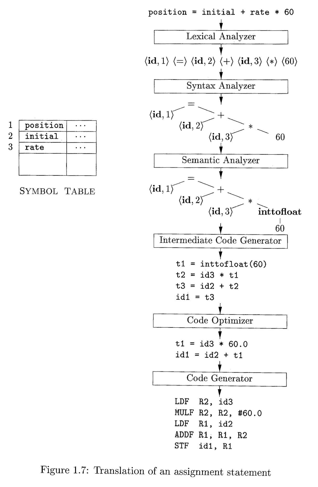

# 1. Introduction

> Programming languages are notations for describing computations to people and to machines. ... But before a program can be run, it first must be translated into a form in which it can be executed by a computer.

> The study of compiler writing touches upon programming languages, mahcine architecture, language theory, algorithms, and software engineering.

## 1.1 Language Processors

> A compiler is a program that can read a program in one language - the source language - and **translate it into** an equivalent program in another language - the target language.

- Important thing to note here is that the program with source language **should be equivalent to** the program with target language.

> An important role of the compiler is to **report any errors** in the source program that it detects **during the translation process**.

> If the target program is an executable machine-language program, it can then be called by the user to **process inputs and produce outputs**.

> An interpreter is another common kind of language processor. Instead of producing a target program as a translation, an interpreter appears to directly execute the operations specified in the source program on inputs supplied by the user.

- The target program produced by a compiler is usually much faster than interpreter.
- Interpreter, on the other hand, can give better error diagnostics than a compiler.

> Java language processors combine compilation and interpretation, ... A java source program may first be compiled into an intermediate form called _bytecodes_. The bytecodes are then interpreted by a virtual machine.

> In order to achieve faster processing of inputs to outputs, some Java compilers, called _just-in-time compilers_, translate the **bytecodes into machine language immediately** before they run the intermediate program to process the input.

- Combining both compiler and interpreter is possible.
- JIT compiler is an optimization techinique, that translates the program which is frequently appears in runtime into machine-readable code(which is much faster). It acts like a caching mechanism for the interpreter.
  Since the compilation process holds in runtime, the compiler takes advantage of the running environment. (Optimized compilation process relying on the processor or the operating system)

&nbsp;&nbsp;&nbsp;&nbsp;&nbsp;&nbsp;&nbsp;&nbsp;**Some keywords:**

- Compiler: A program, that can read a program in one language and translate it into an equivalent program in another language. Compiler is one of the most common language processors.
- Interpreter: A language processor that executes the source program directly with the inputs provided. As it executes the program line by line, usually it gives better analysis about the code.
- Preprocessor: Process the source program before fed into the compiler. Typical use cases are collecting several source programs, replacing shorthands(macros) with related code.
- Assembler: A compiler may produces an assembly-language program as its output, since it is easier to produce and easier to debug than machine code. An _assembler_ takes the assembly language and produces machine code as its output.
- Linker & Loader: Large programs are often compiled in pieces, so the relocatable machine code may be linked together with other relocatable object files and library files into the code that actually runs on the machine. _Linker_ resolves **external memory addresses**, where the code in one file may refer to a location in another file. _Loader_ then puts together all of executable object files **into memory** for execution.

&nbsp;&nbsp;&nbsp;&nbsp;&nbsp;&nbsp;&nbsp;&nbsp;**Language-processing system**

source program
\+ preprocessor -> modified source program  
\+ compiler -> target assembly program  
\+ assembler -> relocatable machine code
\+ linker / loader + library files / relocatable object files -> target machine code

&nbsp;&nbsp;&nbsp;&nbsp;&nbsp;&nbsp;&nbsp;&nbsp;Q. What does 'relocatable' mean?

> Relocation is the process of assigning load addresses for position-dependent code and data of a program and adjusting the code and data to reflect the assigned addresses.

'Relocation' is a process of moving some stuff from one place to another. Say that the program is loaded to the address A. It may contain some absolute addresses, which are valid, but if the program is loaded to a different address B, then we need to update the addresses, translating them by B - A. This is called 'address relocation'.

'relocatable' means we can relocate the addresses of them, using, for example symbol resolution, which replaces symbolic references or names of libraries with **actual addresses in memory** before running a program.

References:

- https://www.wikiwand.com/en/Relocation_(computing)
- https://cs.stackexchange.com/questions/86653/what-does-relocation-mean

## 1.2 The structure of a compiler

> We have treated a compiler as a single box that maps a source program into a semantically equivalent target program. ... there are two parts to this mapping: _analysis_ and _synthesis_

> The analysis part breaks up the source program into constituent pieces and imposes a grammatical structure on them. It then uses this structure to create an _intermediate representation_ of the source program. ... The analysis part also collects **information about the source program** and stores it in a data structure called a _symbol table_, which is passed along with the intermediate representation to the synthesis part.

> The synthesis part constructs the desired target program from the intermediate representation and the information in the symbol table.

- Analysis part do the followings:
  1. Read the program and create intermediate representation
  2. Stores information about the program in a symbol table
- Synthesis part uses IR and symbol table to construct target program.

> If we examine the compilation process in more detail, we see that it operates as a sequence of _phases_, each of which transforms one represnetation of the source program to another.

### 1.2.1 Lexical Analysis

> The first phase of a compiler is called _lexical analysis_ or _scanning_. The lexical analyzer **reads the stream of characters** and groups the characters into **meaningful sequences** called _lexemes_.

### 1.2.2 Syntax Analysis

> The second phases of the compiler is _syntax analysis_ or _parsing_. The parser uses the first compnents of the tokens produced by the lexical analyzer to create a tree-like intermediate representation that depicts the grammatical structure of the token stream.

> A typical representation is a _syntax tree_ in which each interior node represents an operation and the children of the node represent the arguments of the operation.

### 1.2.3 Semantic Analysis

> The semantic analyzer uses the syntax tree and the information in the symbol table to check the source program for **semantic consistency with the language definition**. It also gathers **type information** and saves it in either the syntax tree of the symbol table, for subsequent use during intermediate-code generation.

> An important part of semantic analysis is **type checking**, where the compiler checks that each operator has matching operands.

> The language specification may permit some type conversions called **coercions**.

For instance, an arithmetic operator 'addition' can take integer or floating-point numbers. If the operator is applied to integer and floating-point number, then the compiler converts integer to floating-point number so that the type of operands match.

&nbsp;&nbsp;&nbsp;&nbsp;&nbsp;&nbsp;&nbsp;&nbsp;Q. So is this what 'implicit type conversion' means?

Guess so, and all other works related to "language specification" also take place here.  
Note that syntax analyzer only checks the grammatical structure of the token streams, while semantic analyzer checks the **meaning** of those grammatical objects (node of the syntax tree, in this case).

### 1.2.4 Intermediate Code Generation

> After syntax and semantic analysis of the source program, many compilers generate an **explicit low-level or machine-like IR**, which we can think of as a **program for an abstract machine**.

> This IR should have two important properties: it should be **easy to produce**, and **easy to translate into the target language**.

### 1.2.5 Code Optimization

> The machine-independent code-optimzation phase attempts to improve the intermediate code so that **better target code** will result. Usually "better" means faster, but other objectives may be desired, such as shorter code, or target code that consume less power.

### 1.2.6 Code Generation

> The code generator takes as input an IR of the source program and maps it into the target language.

> If the target language is machine code, registers or memory locations are selected for each of the variables used by the program. Then, the intermediate instructions are translated into sequences of machine instructions that perform the same task.

&nbsp;&nbsp;&nbsp;&nbsp;&nbsp;&nbsp;&nbsp;&nbsp;Q. But when we run the program, the memory address should be changed accordingly. If the compiler selectes the register or the memory location, how can we run the program across the network or with other programs?

- The compiler just selects a register or location for a varaible, and doesn't do anything with the memory addresses.
- Maybe the loader can handle the memory addresses. When we load the program into the memory, to execute it, the loader replaces the memory addresses

&nbsp;&nbsp;&nbsp;&nbsp;&nbsp;&nbsp;&nbsp;&nbsp;Q. If the loader replaces the memory addresses of the program, and we have 2 copy of the program in the memory, then they're not the same since the loader replaces the addresses correspondingly. Is it correct?

- No, that is not correct. If two programs are linked with the same linking options, they will have the same memory address.
- When you run a program, the operating system creates a new process for that program. The process has its own address space, which is separate from the address spaces of other processes. So even if two programs have the same memory addresses, they will be in different address spaces and will not interfere with each other.

### 1.2.7 Symbol-Table Management

> An essential function of a compiler is to record the variable names used in the source program and collect information about various attributes of each name.

> These attributes may provide information about the storage allocated for a name, its type, its scope, and in the case of procedure names, such things as the number and types of its arguments, the method of passing each argument, and the type returned.

### 1.2.8 The Grouping of Phases into Passes

> The discussion of phases deals with the logical organication of a compiler. In an implementation, activities from several phases may be **grouped together** into a pass that **reads an input file and writes an output file**.

### 1.2.9 Compiler-Construction Tools

> ... more specialized tools have been created to help implement various phases of a compiler. ... The most successful tools are those that hide the details of the generation algorithm and produce components that can be easily integrated into the remainder of the compiler.

### Summary

#### The structure of compiler

- A compiler has two parts of its mapping process: 'analysis' and 'synthesis'
- The analysis part uses grammatical structure to validate if the program is syntactically correct or semantically sound.
- The analysis part also stores information about the source program in a **symbol table**.
- The synthesis part constructs the target program using IR and symbol table from analysis part.

#### Different parts of analysis

- Lexical analyzer or scanner reads the characters making up the program and group the characters into **lexemes**.
- Syntax analyzer checks the grammatical structure of the token streams, and produces a syntax tree.
- Semantic analyzer checks the meaning of each node of the syntax tree.

In the actual implementation, instead of local concepts phases, they are grouped into passes, which produces output file for the given input file.