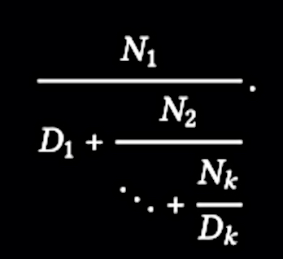

# SICP Note 1.3
### Formulating Abstractions with Higher-Order Procedures

```scheme
(define (cube x) (* x x x))
```

> we are not talking about the cube of a particular number, but rather about a method for obtaining the cube of any number … Of course we could get along without ever defining this procedure, by always writing expressions such as:  

```scheme
(* 3 3 3)
(* x x x)
(* y y y)
```

> This would place us at a serious disadvantage, forcing us to work always at **the level of the particular operations** that happen to be primitives in the language (multiplication, in this case) rather than **in terms of higher-level operations**.  

&nbsp;&nbsp;&nbsp;&nbsp;&nbsp;&nbsp;&nbsp;&nbsp;Q. What’s the meaning of the word `level` in this context?  

- It means a level of **abstraction**.  

> Our programs would be able to compute cubes, but our language would lack **the ability to express the concept of cubing**. One of the things we should demand from a powerful programming language is **the ability to build abstractions by assigning names to common patterns** and then to work in terms of the abstractions directly. Procedures provide this ability. This is why all but the most primitive programming languages include mechanisms for defining procedures.  

- Procedure provides an ability to give a name to some pattern of rules.  

> Often **the same programming pattern will be used with a number of different procedures**. To express such patterns as concepts, we will need to construct procedures that **can accept procedures as arguments or return procedures as values**. Procedures that manipulate procedures are called higher-order procedures. This section shows how higher-order procedures can serve as powerful abstraction mechanisms, vastly increasing the expressive power of our language.  

&nbsp;&nbsp;&nbsp;&nbsp;&nbsp;&nbsp;&nbsp;&nbsp;Q. What is higher-order procedures?  

- A regular procedure provides an ability to make an abstraction by giving a name to common patterns.  
- With higher-order procedures, we can share common patterns across procedures.  
- Higher-order procedures take procedures as arguments or return procedures as values.  
- We’re kind of familiar with this concept. In modern languages like Kotlin, Typescript or Swift, procedures - functions can be used as variables or arguments.  

<br>

### Chapter 1.3.1 Procedures as Arguments

> … We could generate each of the procedures by filling in slots in the same template:  

```scheme
(define ([name] a b)
  (if (> a b)
      0
      (+ ([term] a)
         ([name] ([next] a) b))))
```

- Higher-order procedures abstract **structures**, while normal procedures abstract **operations**, or behaviors.  

&nbsp;&nbsp;&nbsp;&nbsp;&nbsp;&nbsp;&nbsp;&nbsp;Q. But higher-order procedures are also normal procedures, aren’t they?  

- That’s true. Can we consider the common patterns - the structures as behaviors of a procedure? I don’t know. Anyway, higher-order procedure is a subset of procedures.  

> Indeed, mathematicians long ago identified the abstraction of summation of a series and invented “sigma notation” …  

- Sigma notation is an example of higher order function. It expresses the concept of summation - It abstracts the structure of summation, not particular summations.  

> … we would like our language to be powerful enough so that we can write a procedure that **expresses the concept of summation itself rather than only procedures that compute particular sums**.  

Higher-order procedure in Scheme:  
```scheme
(define (sum term a next b)
  (if (> a b)
      0
      (+ (term a)
         (sum term (next a) next b))))
```

With this procedure, we can define a process for a particular summation (sum of cubes, in this case):  
```scheme
(define (inc n) (+ n 1))
(define (sum-cubes a b)
  (sum cube a inc b))
```

We can even define a process for the definite integral of a function f between the limits, a and b.  
  

We can express this directly as a procedure:  
```scheme
(define (integral f a b dx)
  (define (add-dx x)
    (+ x dx))
  (* (sum f (+ a (/ dx 2.0)) add-dx b)
     dx))
```

<br>

###### Exercise 1.29

Simpson’s Rule - The integral of a function f between a and b is approximated as:  
```
h/3 * (y_0 + 4y_1 + 2y_2 + 4y_3 + 2y_4 + ... + 2y_(n-2) + 4y_(n-1) + yn)
```
Where h = `(b - a) / n` for some even integer n, and `y_k = f(a + kh)`  

Define a procedure that takes as arguments f, a, b, and n and returns the value of the integral using Simpson’s Rule!  

My solution:  
```scheme
(define (sum-index mapper a b)
  (if (> a b)
      0
      (+ (mapper a)
         (sum-index mapper (+ a 1) b))))

(define (simpson-integral f a b n)
  (define h (/ (- b a) n))
  (define (yof k) (f (+ a (* k h))))
  (define (mapper index)
    (define y (yof index))
    (cond ((or (= index 0) (= index n)) y)
          ((even? index) (* y 2))
          (else (* y 4))))
  (* (/ h 3) (sum-index mapper 0 n))
)
```

The answers:  
```
(simpson-integral cube 0 1 100)
; 1/4
(simpson-integral cube 0 1 1000)
; 1/4
```
Interesting…  

<br>

###### Exercise 1.30

Rewrite the procedure `sum` as an iterative process:  
```scheme
(define (sum-iter term a next b)
  (define (iter a result)
    (if (> a b)
        result
        (iter (next a) (+ result (term a)))))
  (iter a 0))
```

<br>

###### Exercise 1.31

> … Write an analogous procedure called `product` that returns the product of the values of a function at points over a given range.  
```scheme
(define (product term a next b)
  (if (> a b)
      1
      (* (term a)
         (product term (next a) next b))))
```

> Show how to define factorial in terms of product.  
```scheme
(define (factorial n)
  (define (identity x) x)
  (define (addOne x) (+ x 1))
  (product identity 1 addOne n))
```

> Also use product to compute approximations to 𝜋 using the formula:  
  
```scheme
(define (pi-approx p)
  (define (numerator x)
    (+ (if (even? x)
           x
           (+ x 1))
       2))
  (define (denominator x)
    (+ (if (even? x)
           x
           (- x 1))
       3))
  (define (term x)
    (/ (numerator x)
       (denominator x)))
  (define (addOne x) (+ x 1))
  (product term 0 addOne p))
```

Rewrite `product` so that it is performed iteratively:  
```scheme
(define (product-iter term a next b)
  (define (iter a result)
    (if (> a b)
        result
        (iter (next a) (* (term a) result))))
  (iter a 1))
```

<br>

###### Exercise 1.32

> Show that `sum` and `product` are both special cases of a still more general notion called `accumulate` … Write `accumulate` and show how `sum` and `product` can both be defined as simple calls to `accumulate`.  
```scheme
(define (accumulate combiner null-value term a next b)
  (if (> a b)
      null-value
      (combiner (term a)
                (accumulate combiner null-value term (next a) next b))))
```

Rewrite `accumulate` so that it is performed iteratively:  
```scheme
(define (accumulate-iter combiner null-value term a next b)
  (define (iter a result)
    (if (> a b)
        result
        (iter (next a) (combiner (term a) result))))
  (iter a null-value))
```

<br>

###### Exercise 1.33

> You can obtain an even more general version of accumulate, by introducing the notion of a filter on the terms to be combined …  
```scheme
(define (filtered-accumulate combiner null-value predicate
                             term a next b)
  (if (predicate a b)
      null-value
      (combiner (term a)
                (filtered-accumulate combiner null-value predicate
                                     term (next a) next b))))
```

> Show how to express the following using `filter-accumulate` …  

- The sum of the squares of the prime numbers in the interval a to b:  
```scheme
(define (sum-of-squares-of-prime a b)
  (filtered-accumulate + 0 prime? square a addOne b))
```

- The product of all the positive integers less than n that are relatively prime to n (i.e., all positive integers `i < n` such that `GCD(i, n) = 1`):  
```scheme
(define (gcd a b)
  (if (= b 0)
      a
      (gcd b (remainder a b))))

(define (fff n)
  (define (relatively-prime? a)
    (= (gcd a n) 1))
  (filtered-accumulate * 1 relatively-prime?
                       identity 1 addOne (- n 1)))
```

<br>

###### Summary
- We’ve learned what higher-order procedure means.  
- We’ve investigated various ways to abstract not only a specific behavior, but also the structures behinds various procedures.  

<br>

### Chapter 1.3.2 Constructing Procedures Using lambda

> … it would be more convenient to have a way to directly specify “the procedure that returns its input incremented by 4” and “the procedure that returns the reciprocal of its input times its input plus 2.” We can do this by introducing the special form **lambda**, which creates procedures.  

- lambda is a special form. It creates a procedure.  
- So the name comes from lambda calculus, which is introduced by Alonzo Church.  

> In general, lambda is used to create procedures in the same way as define, except that no name is specified for the procedure:  

```scheme
(lambda ([formal-parameters]) [body])
```

> The resulting procedure is just as much a procedure as one that is created using `define`. The only difference is that it has not been associated with any name in the environment.  

```scheme
(define (plus4 x) (+ x 4))
=
(define plus4 (lambda (x) (+ x 4)))
```

- Basically `define` and `lambda` creates the same procedure.  
- Recall that defining a procedure actually does 2 tasks: “Observe that there are two different operations being combined here: we are creating the procedure, and we are giving it the name square.” (from 1.1.5)  
- lambda only creates a procedure, while define creates and gives a name to the procedure.  

> Like any expression that has a procedure as its value, a lambda expression can be used as the operator in a combination … or more generally, any context where we would normally use a procedure name.  

- We can use a procedure created by lambda just like any other procedures.  

<br>

> Another use of lambda is in creating local variables … we could use a lambda expression to specify an anonymous procedure for binding the local variables:  
```scheme
; a = 1 + xy, b = 1 - y. f(x,y) = xa^2 + yb + ab
(define (f x y)
  ((lambda (a b)
    (+ (* x (square a))
       (* y b)
       (* a b)))
  (+ 1 (* x y))
  (- 1 y)))
```

> This construct is so useful that there is a special form called **let** to make its use more convenient. Using let, the f procedure could be written as:  
```scheme
(define (f x y)

  (let ((a (+ 1 (* x y)))
        (b (- 1 y)))
    (+ (* x (square a))
       (* y b)
       (* a b))))
```

> The general form of a let expression is:  
```
(let ((⟨var1⟩ ⟨exp1⟩)
      (⟨var2⟩ ⟨exp2⟩)
      ...
      (⟨varn⟩ ⟨expn⟩))
    ⟨body⟩)
```

&nbsp;&nbsp;&nbsp;&nbsp;&nbsp;&nbsp;&nbsp;&nbsp;Q. So how `let` expression works? Is it just a syntactic sugar for lambda with local variables?  

- Yes. The author says…  
> No new mechanism is required in the interpreter in order to provide local variables. A `let` expression is simply syntactic sugar for the underlying lambda application.  

&nbsp;&nbsp;&nbsp;&nbsp;&nbsp;&nbsp;&nbsp;&nbsp;Q. So what are these all about? Just for convenience? Or does it have another meaning?  

1. It makes variables locally as possible. Consider the following code snippet that uses `define` to define a local variable.  
```scheme
(define x 5)
(+ (* x 4) x)
; 25
```
- In this case, if the name `x` already exists, then we may lose that name-expression mapping in the environment - which potentially has a chance to behave unexpectedly later. So we should care about the name of the variable, and even if we do so, there’s potential risks to do this way.  
- With `let` expression (Of course it is a special form) you can define a variable without regarding the enclosing environment:  
```scheme
(define x 3)
(+ (let ((x 5))
     (* x 4))
  x)
; 23
```
- In this example, the value of the existing variable `x` is preserved.  
- So the scope of a variable specified by `let` expression is equivalent to the body of the `let`.  

> Sometimes we can use internal definitions to get the same effect as with `let`. We prefer, however, to use `let` in situations like this and to use internal `define` only for internal procedures.  

<br>

###### Exercise 1.34

> Suppose we define the procedure:  
```scheme
(define (f g) (g 2))
```

> What happens if we ask the interpreter to evaluate the combination?  

Speculation:  
- As the interpreter evaluates expressions in an applicative-order, the expression `(f f)` evaluates like this:  
```scheme
(f f)
(f 2)
(2 2) ; There's nothing to break down.
```
- Does it make a list? I’m not sure because I don’t know much about Scheme, but at least it does not fall into an infinite loop, or throw an error.  

Test:  
- It prints a message - `The object 2 is not applicable.`  
- I think the evaluation process is correct, and for `(2 2)`, since 2 is not a operator or a procedure, It throws an error message like that.  
- In the message above, we can observe 2 things. 1) `2` is considered as an object in the interpreter. It is not a number or a string..? 2) It says `not applicable` and does not say something like `is not a procedure` or so.  
- So from the interpreter’s perspective, it doesn’t matter whether an object is a number or a string. The only thing that the interpreter matters is `applicability` - If there’s an object `2` that is applicable, it may not throw an error.  
- But.. defining `2` as a variable is not possible so we don’t need to think about it anyway..  

<br>

### Chapter 1.3.3. Procedures as General Methods

> We introduced **compound procedures** in Section 1.1.4 as a mechanism for **abstracting patterns of numerical operations** so as to make them independent of the particular numbers involved. With **higher-order procedures**, such as the integral procedure of Section 1.3.1, we began to see a more powerful kind of abstraction: **procedures used to express general methods of computation, independent of the particular functions involved**. In this section we discuss **two more elaborate examples— general methods for finding zeros and fixed points of functions—**and show how these methods can be expressed directly as procedures.  

- We introduced two kinds of methods of abstraction: **compound procedure** and **higher-order procedure**  
- We’ll cover 2 additional examples.  

<br>

###### Exercise 1.35

> Show that the golden ratio φ is a fixed point of the transformation x -> 1 + 1/x, and use this fact to compute φ by means of the fixed-point procedure.  

- We can easily formulate the transformation from the definition of the golden ratio:  
```
φ^2 = φ + 1
φ = (φ + 1) / φ		divided by φ
φ = 1 + 1 / φ        resolve the parentheses
```

- We can translate this in Scheme in a natural way:  
```scheme
(define (fixed-point f first-guess)
  (define (try guess)
    (let ((value (f guess)))
      (if (close-enough? guess value)
          value
          (try value))))
  (try first-guess))

(define golden-ratio
  (fixed-point (lambda (x) (+ 1 (/ 1 x))) 1.0))
golden-ratio ; 1.6180327868852458
```

<br>

###### Exercise 1.36

> Modify `fixed-point` so that it prints the sequence of approximations it generates:  
```scheme
(define (fixed-point-print f first-guess)
  (define (try guess)
    (newline)       ; added
    (display guess) ; added
    (let ((value (f guess)))
      (if (close-enough? guess value)
          value
          (try value))))
  (try first-guess))
```

> Then find a solution to `x^x = 1000` by finding a fixed point of `x → log(1000) / log(x)`. Compare the number of steps this takes with and without **average damping**:  
```scheme
(define (xx1000-without-damping)
  (fixed-point-print (lambda (x) (/ (log 1000) (log x))) 3))
(define (xx1000-with-damping)
  (fixed-point-print (lambda (x) (average x (/ (log 1000) (log x)))) 3))

(xx1000-without-damping) ; Number of steps: 32
(xx1000-with-damping) ; Number of steps: 8
```

<br>

###### Exercise 1.37

  
> Define a procedure `cont-frac` which computes the value of the k-term finite continued fraction:  
```scheme
(define (cont-frac n d k)
  (define (f i)
    (if (> i k)
        0
        (/ (n i)
           (+ (d i) (f (+ i 1))))))
  (f 1))
```

> Check your procedure by approximating 1/φ. How large must you make k in order to get an approximation that is accurate to 4 decimal places?  
```scheme
(define (reciprocal-golden-ratio precision)
  (cont-frac (lambda (i) 1.0)
             (lambda (i) 1.0)
             precision))
```
- We can get 11 as the answer, by testing with the procedure above.  
- Here’s a procedure that generates an iterative process instead of a recursive process:  
```scheme
(define (cont-frac-iter n d k)
  (define (f i result)
    (if (= i 0)
        result
        (f (- i 1)
           (/ (n i) (+ (d i) result)))))
  (f k 0))
```
- Note that unlike the recursive solution, index `i` goes down from `k` to `1`. This is because, if we start from 1 then there’s no way to know the second term of the denominator unless do a recursion, as you can see in the definition of k-term finite continued fraction.  
- We know `N_k / D_k`, so starting from here we build a chain of successive fractions.  

<br>

###### Exercise 1.38

> In 1737, the Swiss mathematician Leonhard Euler published a memoir *De Fractionibus Continuis*, which included a continued fraction expansion for `e − 2`, where `e` is the base of the natural logarithms. In this fraction, the `N_i` are all 1, and the `D_i` are successively `1, 2, 1, 1, 4, 1, 1, 6, 1, 1, 8, ...`. Write a program that uses your `cont-frac` procedure from Exercise 1.37 to approximate `e`, based on Euler’s expansion:  
```scheme
(define (euler-expansion precision) 
  (cont-frac (lambda (i) 1.0)
             (lambda (i) 
               (if (= (remainder (+ i 1) 3) 0)
                   (let ((exponent (/ (+ i 1) 3)))
                     (expt 2 exponent))
                   1))
             precision))
(define (natural-constant precision) (+ (euler-expansion precision) 2))
```

<br>

###### Exercise 1.39

  
> Define a procedure `(tan-cf x k)` that computes an approximation to the tangent function based on Lambert’s formula:  
```scheme
(define (tan-cf x k)
  (cont-frac (lambda (i) 
               (if (= i 1)
                   x
                   (- (expt x 2))))
             (lambda (i)
               (- (* i 2.0) 1.0))
             k))
```

<br>

### Chapter 1.3.4 Procedures as Returned Values

> The above examples demonstrate how the ability to pass procedures as arguments significantly enhances the expressive power of our program- ming language. We can achieve even more expressive power by creating procedures whose returned values are themselves procedures.  

- We have seen procedures that take a procedure as an argument. Now we’ll see procedures that return a procedure, as its return value.  

```scheme
(define (average-damp f)
  (lambda (x) (average x (f x))))

((average-damp square) 10) ; aveage-damp itself makes a procedure.
```

> Observe that this is a combination whose operator is itself a combination. Exercise 1.4 already demonstrated the ability to form such combinations, but that was only a toy example. Here we begin to see the real need for such combinations—when applying a procedure that is obtained as the value returned by a higher-order procedure.  

> As programmers, we should be alert to opportunities to identify the underlying abstractions in our programs and to build upon them and generalize them to create more powerful abstractions … it is important to be able to think in terms of these abstractions, so that we can be ready to apply them in new contexts.  

- Using higher-order procedures, we can handle higher abstractions just like other computational elements.  

> In general, programming languages **impose restrictions** on the ways in which computational elements can be manipulated. Elements with the fewest restrictions are said to have **first-class** status. Some of the “rights and privileges” of first-class elements are:  
- They may be named by variables.  
- They may be passes as arguments to procedures.  
- They may be returned as the results of procedures.  
- They may be included in data structures.  

> Lisp, unlike other common programming languages, awards procedures full first-class status. This poses challenges for efficient implementation, but the resulting gain in expressive power is enormous.  

&nbsp;&nbsp;&nbsp;&nbsp;&nbsp;&nbsp;&nbsp;&nbsp;Q. What are some examples of the challenges when we want our procedures to have first-class status?  

- Since the procedures are also variables, they need to be stored somewhere.  
- Maybe we also need to support some “function type”.  

&nbsp;&nbsp;&nbsp;&nbsp;&nbsp;&nbsp;&nbsp;&nbsp;Q. Newton’s method?  

<br>

Next: Review the chapter 1.3.4 and do the exercises.  

