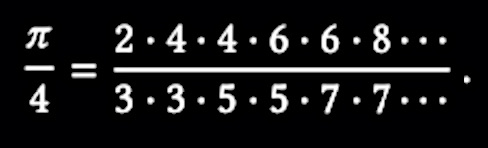

# SICP Note 1.3
### Formulating Abstractions with Higher-Order Procedures

```scheme
(define (cube x) (* x x x))
```

> we are not talking about the cube of a particular number, but rather about a method for obtaining the cube of any number … Of course we could get along without ever defining this procedure, by always writing expressions such as:  

```scheme
(* 3 3 3)
(* x x x)
(* y y y)
```

> This would place us at a serious disadvantage, forcing us to work always at **the level of the particular operations** that happen to be primitives in the language (multiplication, in this case) rather than **in terms of higher-level operations**.  

&nbsp;&nbsp;&nbsp;&nbsp;&nbsp;&nbsp;&nbsp;&nbsp;Q. What’s the meaning of the word `level` in this context?  

- It means a level of **abstraction**.  

> Our programs would be able to compute cubes, but our language would lack **the ability to express the concept of cubing**. One of the things we should demand from a powerful programming language is **the ability to build abstractions by assigning names to common patterns** and then to work in terms of the abstractions directly. Procedures provide this ability. This is why all but the most primitive programming languages include mechanisms for defining procedures.  

- Procedure provides an ability to give a name to some pattern of rules.  

> Often **the same programming pattern will be used with a number of different procedures**. To express such patterns as concepts, we will need to construct procedures that **can accept procedures as arguments or return procedures as values**. Procedures that manipulate procedures are called higher-order procedures. This section shows how higher-order procedures can serve as powerful abstraction mechanisms, vastly increasing the expressive power of our language.  

&nbsp;&nbsp;&nbsp;&nbsp;&nbsp;&nbsp;&nbsp;&nbsp;Q. What is higher-order procedures?  

- A regular procedure provides an ability to make an abstraction by giving a name to common patterns.  
- With higher-order procedures, we can share common patterns across procedures.  
- Higher-order procedures take procedures as arguments or return procedures as values.  
- We’re kind of familiar with this concept. In modern languages like Kotlin, Typescript or Swift, procedures - functions can be used as variables or arguments.  

<br>

### Chapter 1.3.1 Procedures as Arguments

> … We could generate each of the procedures by filling in slots in the same template:  

```scheme
(define ([name] a b)
  (if (> a b)
      0
      (+ ([term] a)
         ([name] ([next] a) b))))
```

- Higher-order procedures abstract **structures**, while normal procedures abstract **operations**, or behaviors.  

&nbsp;&nbsp;&nbsp;&nbsp;&nbsp;&nbsp;&nbsp;&nbsp;Q. But higher-order procedures are also normal procedures, aren’t they?  

- That’s true. Can we consider the common patterns - the structures as behaviors of a procedure? I don’t know. Anyway, higher-order procedure is a subset of procedures.  

> Indeed, mathematicians long ago identified the abstraction of summation of a series and invented “sigma notation” …  

- Sigma notation is an example of higher order function. It expresses the concept of summation - It abstracts the structure of summation, not particular summations.  

> … we would like our language to be powerful enough so that we can write a procedure that **expresses the concept of summation itself rather than only procedures that compute particular sums**.  

Higher-order procedure in Scheme:  
```scheme
(define (sum term a next b)
  (if (> a b)
      0
      (+ (term a)
         (sum term (next a) next b))))
```

With this procedure, we can define a process for a particular summation (sum of cubes, in this case):  
```scheme
(define (inc n) (+ n 1))
(define (sum-cubes a b)
  (sum cube a inc b))
```

We can even define a process for the definite integral of a function f between the limits, a and b.  
  

We can express this directly as a procedure:  
```scheme
(define (integral f a b dx)
  (define (add-dx x)
    (+ x dx))
  (* (sum f (+ a (/ dx 2.0)) add-dx b)
     dx))
```

<br>

### Exercise 1.29

Simpson’s Rule - The integral of a function f between a and b is approximated as:  
```
h/3 * (y_0 + 4y_1 + 2y_2 + 4y_3 + 2y_4 + ... + 2y_(n-2) + 4y_(n-1) + yn)
```
Where h = `(b - a) / n` for some even integer n, and `y_k = f(a + kh)`  

Define a procedure that takes as arguments f, a, b, and n and returns the value of the integral using Simpson’s Rule!  

My solution:  
```scheme
(define (sum-index mapper a b)
  (if (> a b)
      0
      (+ (mapper a)
         (sum-index mapper (+ a 1) b))))

(define (simpson-integral f a b n)
  (define h (/ (- b a) n))
  (define (yof k) (f (+ a (* k h))))
  (define (mapper index)
    (define y (yof index))
    (cond ((or (= index 0) (= index n)) y)
          ((even? index) (* y 2))
          (else (* y 4))))
  (* (/ h 3) (sum-index mapper 0 n))
)
```

The answers:  
```
(simpson-integral cube 0 1 100)
; 1/4
(simpson-integral cube 0 1 1000)
; 1/4
```
Interesting…  

<br>

### Exercise 1.30

Rewrite the procedure `sum` as an iterative process:  
```scheme
(define (sum-iter term a next b)
  (define (iter a result)
    (if (> a b)
        result
        (iter (next a) (+ result (term a)))))
  (iter a 0))
```

<br>

### Exercise 1.31

> … Write an analogous procedure called `product` that returns the product of the values of a function at points over a given range.  
```scheme
(define (product term a next b)
  (if (> a b)
      1
      (* (term a)
         (product term (next a) next b))))
```

> Show how to define factorial in terms of product.  
```scheme
(define (factorial n)
  (define (identity x) x)
  (define (addOne x) (+ x 1))
  (product identity 1 addOne n))
```

> Also use product to compute approximations to 𝜋 using the formula:  

```scheme
(define (pi-approx p)
  (define (numerator x)
    (+ (if (even? x)
           x
           (+ x 1))
       2))
  (define (denominator x)
    (+ (if (even? x)
           x
           (- x 1))
       3))
  (define (term x)
    (/ (numerator x)
       (denominator x)))
  (define (addOne x) (+ x 1))
  (product term 0 addOne p))
```

Rewrite `product` so that it is performed iteratively:  
```scheme
(define (product-iter term a next b)
  (define (iter a result)
    (if (> a b)
        result
        (iter (next a) (* (term a) result))))
  (iter a 1))
```

<br>

### Exercise 1.32

> Show that `sum` and `product` are both special cases of a still more general notion called `accumulate` … Write `accumulate` and show how `sum` and `product` can both be defined as simple calls to `accumulate`.  
```scheme
(define (accumulate combiner null-value term a next b)
  (if (> a b)
      null-value
      (combiner (term a)
                (accumulate combiner null-value term (next a) next b))))
```

Rewrite `accumulate` so that it is performed iteratively:  
```scheme
(define (accumulate-iter combiner null-value term a next b)
  (define (iter a result)
    (if (> a b)
        result
        (iter (next a) (combiner (term a) result))))
  (iter a null-value))
```

<br>

### Exercise 1.33

> You can obtain an even more general version of accumulate, by introducing the notion of a filter on the terms to be combined …  
```scheme
(define (filtered-accumulate combiner null-value predicate
                             term a next b)
  (if (predicate a b)
      null-value
      (combiner (term a)
                (filtered-accumulate combiner null-value predicate
                                     term (next a) next b))))
```

> Show how to express the following using `filter-accumulate` …  

- The sum of the squares of the prime numbers in the interval a to b:  
```scheme
(define (sum-of-squares-of-prime a b)
  (filtered-accumulate + 0 prime? square a addOne b))
```

- The product of all the positive integers less than n that are relatively prime to n (i.e., all positive integers `i < n` such that `GCD(i, n) = 1`):  
```scheme
(define (gcd a b)
  (if (= b 0)
      a
      (gcd b (remainder a b))))

(define (fff n)
  (define (relatively-prime? a)
    (= (gcd a n) 1))
  (filtered-accumulate * 1 relatively-prime?
                       identity 1 addOne (- n 1)))
```

<br>

### Chapter 1.3.2 Constructing Procedures Using lambda

> … it would be more convenient to have a way to directly specify “the procedure that returns its input incremented by 4” and “the procedure that returns the reciprocal of its input times its input plus 2.” We can do this by introducing the special form **lambda**, which creates procedures.  

- lambda is a special form. It creates a procedure.  
- So the name comes from lambda calculus, which is introduced by Alonzo Church.  

> In general, lambda is used to create procedures in the same way as define, except that no name is specified for the procedure:  

```scheme
(lambda ([formal-parameters]) [body])
```

> The resulting procedure is just as much a procedure as one that is created using `define`. The only difference is that it has not been associated with any name in the environment.  

```scheme
(define (plus4 x) (+ x 4))
=
(define plus4 (lambda (x) (+ x 4)))
```

- Basically `define` and `lambda` creates the same procedure.  
- Recall that defining a procedure actually does 2 tasks: “Observe that there are two different operations being combined here: we are creating the procedure, and we are giving it the name square.” (from 1.1.5)  
- lambda only creates a procedure, while define creates and gives a name to the procedure.  

> Like any expression that has a procedure as its value, a lambda expression can be used as the operator in a combination … or more generally, any context where we would normally use a procedure name.  

- We can use a procedure created by lambda just like any other procedures.  

<br>

> Another use of lambda is in creating local variables … we could use a lambda expression to specify an anonymous procedure for binding the local variables:  
```scheme
; a = 1 + xy, b = 1 - y. f(x,y) = xa^2 + yb + ab
(define (f x y)
  ((lambda (a b)
    (+ (* x (square a))
       (* y b)
       (* a b)))
  (+ 1 (* x y))
  (- 1 y)))
```

> This construct is so useful that there is a special form called **let** to make its use more convenient. Using let, the f procedure could be written as:  
```scheme
(define (f x y)
(let ((a (+ 1 (* x y)))
        (b (- 1 y)))
    (+ (* x (square a))
       (* y b)
       (* a b))))
```

> The general form of a let expression is:  
```
(let ((⟨var1⟩ ⟨exp1⟩)
      (⟨var2⟩ ⟨exp2⟩)
      ...
      (⟨varn⟩ ⟨expn⟩))
    ⟨body⟩)
```

&nbsp;&nbsp;&nbsp;&nbsp;&nbsp;&nbsp;&nbsp;&nbsp;Q. So how `let` expression works? Is it just a syntactic sugar for lambda with local variables?  

- Yes. The author says…  
> No new mechanism is required in the interpreter in order to provide local variables. A `let` expression is simply syntactic sugar for the underlying lambda application.  

&nbsp;&nbsp;&nbsp;&nbsp;&nbsp;&nbsp;&nbsp;&nbsp;Q. So what are these all about? Just for convenience? Or does it have another meaning?  
