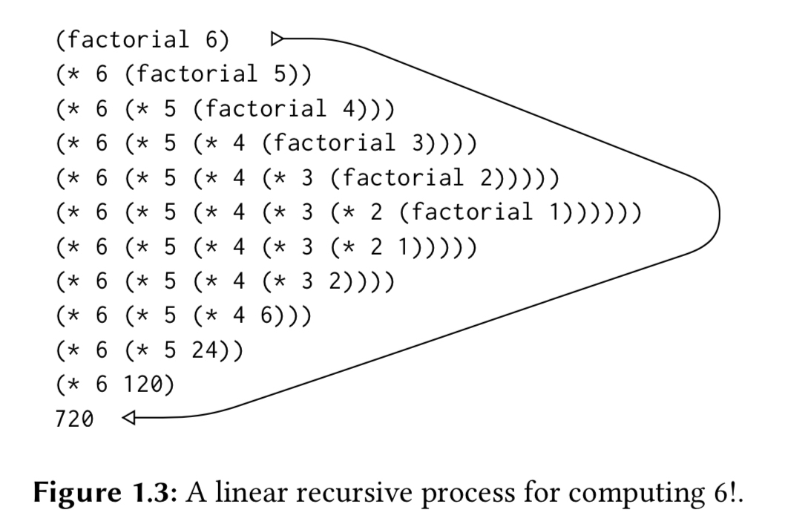
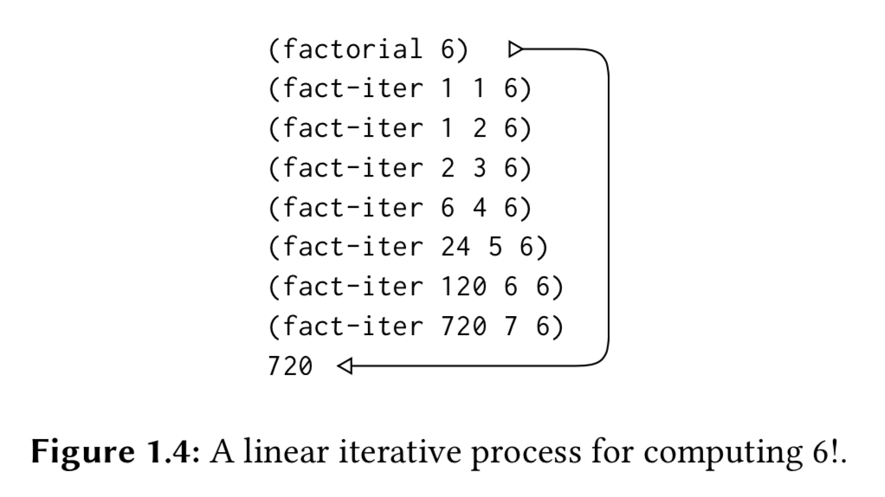
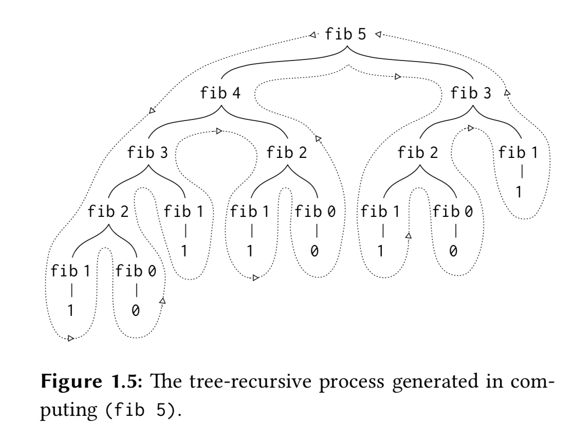

# SICP Note 1.2
### Procedures and the Processes They Generate

> Now I know the elements of programming - primitives, combinations, and abstractions. But I don’t know how to use it, and what will be happen, as a result of using it.  
> The **ability to visualize the consequences of the actions under consideration** is crucial to becoming an expert programmer …  where we control the process by means of program. … To become experts, we must learn to visualize the processes generated by various types of procedures.  

&nbsp;&nbsp;&nbsp;&nbsp;&nbsp;&nbsp;&nbsp;&nbsp;Q. Do procedures generate the computational processes?  

- A procedure specifies how each stage of the process, is built upon the previous stage. So if there’s `s1` and `s2` that are any two subsequent stages of the process, a procedure is a description of the transition from `s1` to `s2`.  
- Repeatedly applying the procedure creates multiple stages of the process - and we may say the procedure generates the process.  

> A procedure is a pattern for the **local evolution** of a computational process. It specifies **how each stage of the process is built upon the previous stage**. We would like to be able to make statements about the overall, or *global*, behavior of a process where local evolution has been specified by a procedure. This is very difficult to do in general, but we can at least try to describe some typical patterns of process evolution.  

&nbsp;&nbsp;&nbsp;&nbsp;&nbsp;&nbsp;&nbsp;&nbsp;Q. What the heck. What is the **evolution of a computational process**?  

- It is a transition from one stage of the process to another stage of the process.  

&nbsp;&nbsp;&nbsp;&nbsp;&nbsp;&nbsp;&nbsp;&nbsp;Q. What’s different from **local evolution**?  

- Local evolution of a process means a transition from one stage to **the next** stage of the process. And these local evolutions composes a whole evolution of a process.  

> In this section we will examine some common **shapes** for processes generated by simple procedures. We will also investigate the rates at which these processes consume the important computational resources of time and space.  

<br>

### Chapter 1.2.1 Linear Recursion and Iteration

> we can compute n! by computing (n − 1)! and multiplying the result by n. If we add the stipulation that 1! Is equal to, this observation translates directly into a procedure:  
```scheme
(define (factorial n)
  (if (= n 1)
    1
    (** n (factorial (- n 1)))))
```


> The substitution model reveals a shape of expansion followed by contraction, …  
> The expansion occurs as the process builds up a chain of deferred operations. The contraction occurs as the operations are actually performed. This type of process, characterized by a **chain of deferred operations**, is called a **recursive process**. Carrying out this process requires that the interpreter keep track of the operations to be performed later on.  

&nbsp;&nbsp;&nbsp;&nbsp;&nbsp;&nbsp;&nbsp;&nbsp;Q. What is a recursive process?  

- It is a process that builds up a chain of deferred operations, as it evolves by evaluating the procedure in sequence.  
- It has a shape that expands as the process evolves and contracts as the operations are performed.  
- The interpreter needs to maintain some information - a chain of deferred operations.  
- Another interesting thing to note here, is that this type of evaluation is a kind of normal-order evaluation, even though the interpreter follows applicative-order evaluation strategy.  

<br>

> We could describe a **rule** for computing n! by specifying that we first multiply 1 by 2, then multiply the result by 3, then by 4, and so on until we reach n. More formally, we maintain a running product, together with a counter that counts from 1 up to n:  
```scheme
(define (factorial n) (fact-iter 1 1 n))
(define (fact-iter product counter max-count) (if (> counter max-count)
      product
      (fact-iter (** counter product)
                 (+ counter 1)
                 max-count)))
```


> At each step, all we need to keep track of, for any n, are the current values of the variables … We call this an **iterative process**. In general, an iterative process is one **whose state can be summarized by a fixed number of state variables**, together with a fixed rule that describes *how the state variables should be updated* as the process moves from state to state and (optional) *end test that specifies conditions under which the process should terminate*.  

&nbsp;&nbsp;&nbsp;&nbsp;&nbsp;&nbsp;&nbsp;&nbsp;Q. What is an iterative process?  

- It is a process whose state can be summarized by a fixed number of state variables.  
- It also requires 1) How the state variables changes as the process evolves, 2) conditions indicating  when the process should terminate.  
- It has a flat shape.  
- There’s no need to maintain some hidden information for the process. Instead, **the program variables provide a complete description of the state of the process at any point.** So if we stopped the process, then we can resume the process by giving the interpreter the variables at that point.  
- So there’s a *mapping between the variables and the state of the process*.  
- How about coroutines? The concept of continuation looks similar to this concept. - the state of the running process?  

&nbsp;&nbsp;&nbsp;&nbsp;&nbsp;&nbsp;&nbsp;&nbsp;Q. But are the variables sufficient to describe the whole process?  

- Of course, those variables describe the state of the process, but they don’t give any clue about the tasks which should be done by the process.  
- So the variables are sufficient to describe the state of the process, but we need more information about what it does in order to describe the whole process.  

&nbsp;&nbsp;&nbsp;&nbsp;&nbsp;&nbsp;&nbsp;&nbsp;Q. What is the difference between recursive and iterative process?  

- One difference between them, is the shape. In case of recursive process, we builds a chain of operations, and perform the operations if there’s nothing to make a chain of, so it has a convex shape. In iterative process, we perform the operation using the variables provided, so it has a flat shape.  
- Another difference is whether we can describe each state of the process. In recursive process, the state of the process is hidden inside the interpreter, while in iterative process, the state of the process is described by the state variables.  
- Other properties - a number of operations performed, or a sequence of operations, etc. - are the same.  

&nbsp;&nbsp;&nbsp;&nbsp;&nbsp;&nbsp;&nbsp;&nbsp;Q. What is a “shape” of a process?  

- There’s no explicit mentions about it. But as far as I guess, it’s just about **how the process evolves**.  
- And now we have a clue about what “the evolution of a process” means. Recall the following statement before: “A procedure is a pattern for the local evolution of a computational process. It specifies **how each stage of the process is built upon the previous stage**.”  
Consider a recursive process. It starts from the expression `(factorial 6)` and it evaluates to `(** 6 (factorial 5))`.  
- The first stage of the process is `(factorial 6)`. By evaluating the procedure, we have the second stage of the process `(** 6 (factorial 5))`. The process **evolves**.  
- A procedure specifies “how each stage of the process is built upon the previous stage.” - A procedure `factorial` specifies how `(** n (factorial (- n 1)))` is built upon `(factorial n)`  
- And the procedure is for **local** evolution because a procedure only specifies about one stage and its next stage of the process and the whole process may consist of multiple stages.  

&nbsp;&nbsp;&nbsp;&nbsp;&nbsp;&nbsp;&nbsp;&nbsp;Q. So what is an evolution of a process?  

- It is a transition from one stage of the process to another stage of the process.  

&nbsp;&nbsp;&nbsp;&nbsp;&nbsp;&nbsp;&nbsp;&nbsp;Q. Why are they “linear”?  

- They are linear, because the length of a chain of deferred operations (in recursive process) and the number of steps (in iterative process) grows linearly with the input `n`.  

<br>

> In contrasting iteration and recursion, we must be careful **not to confuse the notion of a recursive process with the notion of a recursive procedure**. When we describe a procedure as recursive, we are referring to the syntactic fact that the procedure definition refers (either directly or indirectly) to the procedure itself. But when we describe a process as following a pattern that is, say, linearly recursive, we are speaking about how the process evolves, not about the syntax of how a procedure is written. …  

- Recursive procedure - the procedure definition refers to itself.  
- Linearly recursive process - about “how the process evolves”  
- **We can use recursive procedures to generate an iterative process**.  

> One reason that the distinction between process and procedure may be confusing is that most implementations of common languages are designed in such a way that the interpretation of any recursive procedure consumes an amount of memory that grows with the number of procedure calls, even when the process described is, in principle, iterative.  
> As a consequence, these languages can describe iterative processes only by resorting to special-purpose “loop- ing constructs” such as do, repeat, until, for, and while. …  

> The implementation of Scheme we shall consider in Chapter 5 does not share this defect. It will execute an iterative process in constant space, even if the iterative process is described by a recursive procedure.  
> An implementation with this property is called tail-recursive. With a tail-recursive implementation, iteration can be expressed using the ordinary procedure call mechanism, so that special iteration constructs are useful only as syntactic sugar.  

- Do not think of iterative processes as looping constructs. (do, while, for, …)  

&nbsp;&nbsp;&nbsp;&nbsp;&nbsp;&nbsp;&nbsp;&nbsp;Q. What is tail-recursive property?  

- It’s a property that executes an iterative process in constant space, even the process is described by a recursive procedure.  

> Using the substitution model, illustrate the process generated by each procedure in evaluating the expression.  

<br>

###### Summary
* We discussed about the evolution of computational process, and the relation between a process, a procedure and an expression.  
* We talked about the shape of a procedure, that is, how the process evolves.  
* We noticed that recursive process may not be generated by recursive procedure, and iterative process may not be generated by iterative procedure.  
* We’ve also figured out what tail-recursive property is, and how it can help to build an iterative process using recursive procedures.  

<br>

###### Exercises 1.9

```scheme
(define (+ a b)
  (if (= a 0)
    b
    (inc (+ (dec a) b))))

Then..

(+ 4 5)
(inc (+ (dec 4) 5))
(inc (+ 3 5))
(inc (inc (+ (dec 3) 5)))
(inc (inc (+ 2 5)))
(inc (inc (inc (+ (dec 2) 5))))
(inc (inc (inc (+ 1 5))))
(inc (inc (inc (inc (+ (dec 1) 5)))))
(inc (inc (inc (inc (+ 0 5)))))
(inc (inc (inc (inc 5))))
(inc (inc (inc 6)))
(inc (inc 7))
(inc 8)
9

-> It's a recursive process, because it extends and then contracts, and the intermediate states are hidden in the interpreter.
```

```scheme
(define (+ a b)
  (if (= a 0)
    b
    (+ (dec a) (inc b))))

Then..

(+ 4 5)
(+ (dec 4) (inc 5))
(+ 3 6)
(+ (dec 3) (inc 6))
(+ 2 7)
(+ (dec 2) (inc 7))
(+ 1 8)
(+ (dec 1) (inc 8))
(+ 0 9)
9

It's an iterative process, because it has a flat shape, and the paramters of each step can fully describe the state of the process.
```

###### Exercise 1.10

```scheme
(define (A x y)
  (cond ((= y 0) 0)
        ((= x 0) (** 2 y))
        ((= y 1) 2)
        (else (A (- x 1) (A x (- y 1))))))

(A 1 10)
(** (A 1 9) 2)
(** (A 1 8) 2 2)
...
(** (A 1 1) 2 2 2 2 2 2 2 2 2)
(** 2 2 2 2 2 2 2 2 2 2)
= 2^10

(A 2 2)
(A 1 (A 2 1))
(A 1 2)
=2^2

(A 2 3)
(A 1 (A 2 2))
(A 1 (A 1 (A 2 1)))
(A 1 (A 1 2))
(A 1 4))
=2^2^2

(A 2 4)
(A 1 (A 1 (A 1 (A 2 1))))
(A 1 (A 1 (A 1 2)))
(A 1 (A 1 4))
(A 1 16)
=2^2^2^2

A 2 n = 2^(2^(A 2 n-2))

(define (f n) (A 0 n)) = 2n
(define (g n) (A 1 n)) = 0 for n = 0, 2^n for n > 1
(define (g n) (A 2 n)) = 0 for n = 0, 2 for n = 1, 2^2^... (n times) for n > 1
```

<br>

### Chapter 1.2.2 Tree Recursion

> Another common pattern of computation is called **tree recursion**. As an example, consider computing the sequence of Fibonacci numbers, in which each number is the sum of the preceding two:  
> 	0, 1, 1, 2, 3, 5, 8, 13, 21, …  

Here’s an implementation of a procedure that computes Fibonacci numbers, using tree recursion:  
```scheme
(define (fib n)
  (cond ((= n 0) 0)
        ((= n 1) 1)
        (else (+ (fib (- n 1))
                 (fib (- n 2))))))
```


> In general, **the evolved process looks like a tree**, as shown in Figure 1.5.  Notice that the branches split into two at each level (except at the bottom) - this reflects the fact that the `fib` procedure calls itself twice each time it is invoked …  
> This procedure is instructive as a prototypical tree recursion, but it is **a terrible way to compute Fibonacci numbers** because **it does so much redundant computation.** …  

&nbsp;&nbsp;&nbsp;&nbsp;&nbsp;&nbsp;&nbsp;&nbsp;Q. Why is tree recursion a terrible way to compute Fibonacci numbers?  

- It is because the number of computation is Fib(n+1), and the value of Fib(n) grows exponentially with n, and there is a lot of redundant computations.  
- … The author said “a terrible way”, but sometimes there’s no better implementation of the process or we haven’t find it yet.  

> … Thus the process uses a number of steps that **grows exponentially with the input**. On the other hand, the space required grows only linearly with the input, because **we need keep track only of which nodes are above us in the tree** at any point in the computation.  

- The number of steps is proportional to the **number of nodes**.  
- The amount of space required is proportional to the **depth of the tree**.  

Here’s an iterative process to compute Fibonacci numbers:  
```scheme
(define (fib n) (fib-iter 1 0 n))
(define (fib-iter a b count)
  (if (= count 0)
      b
      (fib-iter (+ a b) a (- count 1))))
```

<br>

> One should not conclude from this that tree-recursive processes are useless. When we consider processes that operate on hierarchically structured data rather than numbers, we will find that tree recursion is a natural and powerful tool. But even in numerical operations, tree-recursive processes can be useful in helping us to understand and design programs.  

- It seems that tree-recursive processes are useless, compared to iterative process, but that’s not true.  
- When the process operates on **hierarchically structured data**, rather than numbers, tree-recursion is pretty useful. The evaluation process of the interpreter, is one of the examples of tree-recursion.  
- Although tree-recursion process is much less efficient than iterative process, it is more straightforward to illustrate the process as is. We can directly translate the definition of Fibonacci sequence into Lisp. Fibonacci sequence is relatively easy to come up with the iterative process. But for more complicated algorithms, it’s difficult to find more efficient approaches.  

###### Example: Counting Change

> Consider the following problem: can we write a procedure to compute the number of ways to change any given amount of money and kinds of coins?  

Assume that we choose a certain coin at each step. There are 2 cases: Pick a certain coin, or not.  
1. If we pick a coin, the remaining amount is the original amount - the denomination of the coin. With this amount, we head over to the next step, and once again, there are 2 choices.  
2. If we don’t pick a coin, then the number of kinds of coins is decreased by 1, and the amount remains unchanged. With these kinds of coins, we go to the next step, and make a choice again.  

> One approach to coping with redundant computations is to arrange matters so that we automatically **construct a table of values as they are computed**. Each time we are asked to apply the procedure to some argument, we first look to see if the value is already stored in the table, in which case we avoid performing the redundant computation. This strategy, known as **tabulation or memoization**, can be implemented in a straightforward way. Tabulation can sometimes be used to transform processes that require an exponential number of steps (such as count-change) into processes whose space and time requirements grow linearly with the input.  

&nbsp;&nbsp;&nbsp;&nbsp;&nbsp;&nbsp;&nbsp;&nbsp;Q. What is memoization? Why should one use it?  

- Memoization, or tabulation is a strategy to make a mapping table using the result of computations along with the inputs. So when we apply the procedure to the arguments, we first look to see if the value is already exist in the table, to **avoid redundant computation**.  
- To memoize a procedure, the procedure is required to always produce the same result for the same arguments.  

> … **by means of a recursive process**.  

- Hmm..  

###### Exercise 1.11

c <- b  
b <- a  
a <- a + 2b + 3c  

```scheme
;recursive process
(define (f n)
  (if (< n 3)
      n
      (+ (f (- n 1)) (** 2 (f (- n 2))) (** 3 (f (- n 3))) )))

;iterative process
(define (f n) (f-iter 2 1 0 n))
(define (f-iter a b c n)
  (if (= n 0)
      c
      (f-iter (+ a (** 2 b) (** 3 c)) a b (- n 1))))
```

###### Exercise 1.12

> The elements of Pascal’s triangle are called the binomial coefficients, because the nth row consists of the coefficients of the terms in the expansion of (x + y)^n …  

```
<Algorithm>
P(d, i) = P(d - 1, i - 1) + P(d - 1, i)
Where d is a depth, and i is the index of the row.

Edge cases:
P(d, 0) = 0
P(d, d) = 0
P(1, i) = 1
```

```scheme
(define (p d) (p-iter d d))

(define (p-iter d c)
  (if (= c 0)
    ()
    (cons (pascal d c) (p-iter d (- c 1)))
  )
)

(define (pascal d i)
  (cond ((or (> i d) (< i 1)) 0)
        ((< d 2) 1)
        (else (+
          (pascal (- d 1) (- i 1))
          (pascal (- d 1) i)
        ))
  )
)

```

<br>

### Chapter 1.2.3 Orders of Growth

> The previous examples illustrate that processes can differ considerably in the rates at which they consume computational resources. One convenient way to describe this difference is to use the notion of **order of growth** to obtain a **gross measure of the resources required by a process as the inputs become larger**.  

> Let n be a parameter that measures the size of the problem, and let R(n) be the amount of resources the process requires for a problem of size n. … In general there are a number of properties of the problem with respect to which it will be desirable to analyze a given process. Similarly, R(n) might measure the number of internal storage registers used, the number of elementary machine operations performed, and so on. …  

- So let’s not conclude that `n` is the input size and `R(n)` is the time used by the process. `n` can be any property of the problem, and `R(n)` can also be any measurement of computational resource. It depends on various perspectives or goal of an analysis.  

> We say that **R(n) has order of growth Θ(f(n))**, written **R(n) = Θ(f(n))** (pronounced “theta of f(n)”), if there are positive constants k1 and k2 independent of n such that k1 f(n) ≤ R(n) ≤ k2 f(n) for *any sufficiently large value of n*.  

- This is the definition of Big-O notation. We can rewrite the definition above like this (From wikipedia):  
[image:CBDA4946-0C08-42CA-8A30-B39E26839851-59419-00009FAF2E46BAC8/F70D3784-FCF0-4FB8-9D89-C16F3D273238.png]  

> These statements mask a great deal of oversimplification. For instance, if we count process steps as “machine operations” we are making the assumption that the number of machine operations needed to perform, say, a multiplication is independent of the size of the numbers to be multiplied, which is false if the numbers are sufficiently large. Similar remarks hold for the estimates of space. Like the design and description of a process, **the analysis of a process can be carried out at various levels of abstraction.**  

&nbsp;&nbsp;&nbsp;&nbsp;&nbsp;&nbsp;&nbsp;&nbsp;Q. What does it mean? “Order of growth”?  

- From mathematics…  
> the order of a polynomial may refer to the  [degree of a polynomial](https://en.wikipedia.org/wiki/Degree_of_a_polynomial) , that is, the **largest exponent** (for a  [univariate polynomial](https://en.wikipedia.org/wiki/Univariate_polynomial) ) or the largest sum of exponents (for a  [multivariate polynomial](https://en.wikipedia.org/wiki/Multivariate_polynomial) ) in any of its monomials.  

- From Google Translate…  
> order - **the degree of complexity** of an equation, expression, etc., as denoted by an ordinal number  

- The order of growth refers to how the amount of computational resources denoted by `R(n)` used by the process changes, given an any property `n` of the process.  
- So from my own speculation, the closest meaning of the word “order” in this context is "rate"  
- “growth” means increase of something, I guess.  

> Orders of growth provide only a crude description of the behavior of a process. For example, a process requiring n^2 steps and a process requiring 1000n^2 steps and a process requiring 3n^2 + 10n + 17 steps all have Θ(n^2) order of growth.  
> On the other hand, order of growth provides a useful indication of how we may expect the behavior of the process to change as we change the size of the problem. For a Θ(n) (linear) process, doubling the size will roughly double the amount of resources used. For an exponential process, each increment in problem size will multiply the resource utilization by a constant factor. In the remainder of Section 1.2 we will examine two algorithms whose order of growth is logarithmic, so that doubling the problem size increases the resource requirement by a constant amount.  

- Order of growth simplifies the behavior of a process in terms of the relation between the input and the resource required. Like most abstraction, order of growth hides the details, and only focus on some sides of the problem.  
- We lose the exact measures and differences between the processes, but we can easily predict how much the amount of computational resource is needed as the input `n` grows.  

###### Summary

* I know the **order of growth** of a process.  
* I know what `n` and `R(n)` can be.  
* I know the tradeoffs of order of growth.  

###### Exercise 1.14

My thoughts:  

> Draw the tree illustrating the process generated by the count-change procedure of Section 1.2.2 in making change for 11 cents.  
> What are the orders of growth of the space and number of steps used by this process as the amount to be changed increases?  

`n`: The amount to be changed  
`R(n)`: The space and number of steps  

- The space and number of steps grows **linearly** as the amount to be changed increases. Recall the definition of the process:  

The number of ways to change amount `a` using `n` kinds of coins equals  
* the number of ways to change amount `a` using all but the first kind of coin (`n - 1`, plus  
* the number of ways to change amount `a − d` using all `n` kinds of coins, where `d` is the denomination of the first kind of coin.  

If the amount increases by `d`, the number of ways in step 2 becomes the number of ways in the original process. And this branching happens `n` times.  

The true answer: [sicp-ex-1.14](http://community.schemewiki.org/?sicp-ex-1.14)  

###### Exercise 1.15

My thought:  

```scheme
(define (cube x) (** x x x))
(define (p x) (- (** 3 x) (** 4 (cube x))))
(define (sine angle)
  (if (not (> (abs angle) 0.1))
      angle
      (p (sine (/ angle 3.0)))))
```

> How many times is the procedure `p` applied when `(sine 12.15)` is evaluated?  

```
(sine 12.15)
= (p (sine 4.05))
= (p (p (sine 1.35)))
= (p (p (p (sine 0.45))))
= (p (p (p (p (sine 0.15)))))
= (p (p (p (p (p (sine 0.05))))))
= (p (p (p (p (p 0.05)))))
```

5 times.  

> What is the order of growth in space and number of steps used by the process generated by the `sine` procedure when `(sine a)` is evaluated?  

* The order of growth in space is proportional to the amount of deferred operations stored in the interpreter. The recursive call ends when the input provided to `sine` is less than 0.1.  
so `d` is a value that meets the condition:  
```
a ** 3^-d < 0.1
log3(a) ** -d < log3(0.1)
d < -log3(0.1)/log3(a)
```
`d` will grow **logarithmically** as the input `a` grows: `O(log3(a))`  

* The order of growth in the number of steps is equal to the order of growth in space, because there’s only one operation in each depth.  

The answer: [JoT's Jottings: SICP Exercise 1.15: The Sines of the Fathers](http://jots-jottings.blogspot.com/2011/09/sicp-115-sines-of-fathers.html)  

From the answer, the thing I missed:  
* We know that `logx(1) = 0` for any x, but the terminating condition is when `a < 0.1`, so we should multiply `a` by 10 in the order of growth to account for it: `O(log3(10a))`  

<br>

### Chapter 1.2.4 Exponentiation

> “The process evolved by fast-expt” grows **logarithmically** with n in both and number of steps. … To see this, observe that computing b^(2n) using fast-expt requires only one more multiplication than computing b^n. … Thus **the number of multiplications required for an exponent of n grows about as fast as “the logarithm of n to the base 2”.** The process has Θ(log n) growth.  

###### Exercise 1.16

> define the state transformation in such a way that the product ab^n is unchanged from state to state. … In general, the technique of defining an **invariant quantity** that **remains unchanged from state to state** is a powerful way to think about the design of iterative algorithms  

Based on the fact that `b^n = b^2^(n/2)`  

```scheme
(define (exp-iter b n)
  (define (iter a b n)
    (cond ((= n 0) a)
          ((even? n) (iter a (** b b) (/ n 2)))
          (else (iter (** a b) b (- n 1)))
    )
  )
  (iter 1 b n)
)
```

###### Exercise 1.17

> … design a multiplication procedure analogous to fast-expt that uses a logarithmic number of steps.  

```scheme
(define (double n) (** n 2))
(define (halve n) (/ n 2))
(define (mul a b)
  (cond ((= b 0) 0)
        ((= b 1) a)
        ((even? b) (+ (mul a (halve b)) (mul a (halve b))))
        (else (+ (mul a (- b 1)) a))
  )
)
```

###### Exercise 1.18

> Using the results of Exercise 1.16 and Exercise 1.17, devise a procedure that generates **an iterative process** for multiplying two integers in terms of adding, doubling, and halving and uses a logarithmic number of steps.  

- Iterative version of 1.18!  

```scheme
(define (mul-iter a b)
  (define (iter r a b)
    (cond ((= b 0) 0)
          ((= b 1) (+ r a))
          ((even? b) (iter r (double a) (halve b)))
          (else (iter (+ r a) a (- b 1)) )
    )
  )
  (iter 0 a b)
)
```

###### Exercise 1.19

> There is a clever algorithm for computing the Fibonacci numbers in a logarithmic number of steps … Recall the transformation of the state variables a and b in `fib-iter` process: `a <- a + b and b <- a`  

```scheme
(define (square x) (** x x))
(define (fib n) (fib-iter 1 0 0 1 n))
(define (fib-iter a b p q count) (cond ((= count 0) b)
        ((even? count)
         (fib-iter a
                   b
                   (+ (square p) (square q))
                   (+ (square q) (** 2 p q))
                   (/ count 2)))
        (else (fib-iter
                (+ (** b q) (** a q) (** a p))
                (+ (** b p) (** a q))
                p
                q
                (- count 1)))))
```

###### Summary
* Examined some processes that grows logarithmically. They grows as fast as the logarithm of `n` to some base.  
* Feel the usefulness of successive squaring and its implementations.  

- For the processes that grows logarithmically with `n`, there’s multiplication or division to iteration variable, while for the linear processes, there’s addition or subtraction to iteration variable.  

### Chapter 1.2.5 Greatest Common Divisors

> The idea of the algorithm is based on the observation that, if `r` is the remainder when `a` is divided by `b`, then the common divisors of `a` and `b` are precisely the same as the common divisors of `b` and `r` …  

```
GCD(a,b) = GCD(b,r)
```

- Euclid’s Algorithm  

> Lamé’s Theorem: If Euclid’s Algorithm requires k steps to compute the GCD of some pair, then the smaller number in the pair must be greater than or equal to the k-to Fibonacci number.  
> **We can use this theorem to get an order-of-growth estimate for Euclid’s Algorithm.**  

- Is this something computational complexity theorist do?  

###### Exercise 1.20

> **The process that a procedure generates is of course dependent on the rules used by the interpreter**. As an example, consider the iterative gcd procedure given above. Suppose we were to interpret this procedure using normal-order evaluation, as discussed in Section 1.1.5. (The normal-order-evaluation rule for if is described in Exercise 1.5.)  
> -> Using the substitution method (for normal order), illustrate the process generated in evaluating `(gcd 206 40)` and indicate the remainder operations that are actually performed. How many remainder operations are actually performed in the normal-order evaluation of `(gcd 206 40)`? In the applicative-order evaluation?  

Evaluation  for `if` for both normal/applicative-order:  
> The **predicate expression is evaluated first**, and the **result determines whether to evaluate the consequent or the alternative expression**.  

```scheme
(define (gcd a b)
  (if (= b 0)
      a
      (gcd b (remainder a b)))
)
```

For normal-order evaluation…  
```
a, b = The first arguments
ai, bi = The arguments provided to i-th recusive invocation of gcd.
N_ai, N_bi = The number of the remainder operations that are actually performed, for a_i, and b_i respectively.

a1 <- a     => N_a1 = 0
b1 <- a % b => N_b1 = 1
a2 <- b1      => N_a2 = N_b1 = 1
b2 <- a1 % b1 => N_b2 = N_a1 + N_b1 + 1 = 2
a3 <- b2      => N_a3 = N_b2 = 2
b3 <- a2 % b2 => N_b3 = N_a2 + N_b2 + 1 = 4
a4 <- b3      => 4
b4 <- a3 % b3 => N_b4 = N_a3 + N_b3 + 1 = 7
a5 = 7
b5 = 12
N_b5 = (N_a4 + N_b4 + 1)
     = (N_a4 + (N_a3 + N_b3 + 1) + 1)
     = (N_a4 + (N_a3 + (N_a2 + N_b2 + 1) + 1) + 1)
     = (N_b3 + (N_b2 + (N_b1 + (N_a1 + N_b1 + 1) + 1) + 1) + 1)
     = ((N_a2 + N_b2 + 1) + ((N_a1 + N_b1 + 1) + (N_b1 + (N_a1 + N_b1 + 1) + 1) + 1) + 1)
     = ((N_b1 + (N_a1 + N_b1 + 1) + 1) + ((N_a1 + N_b1 + 1) + (N_b1 + (N_a1 + N_b1 + 1) + 1) + 1) + 1)
...
an <- b(n-1)          => N_an = N_b(n-1)
                              = SUM(Fib(i+1) for i from 1 to (n-1))
bn <- a(n-1) % b(n-1) => N_bn = N_a(n-1) + N_b(n-1) + 1
                              = SUM(Fib(i+1) for i from 1 to n)

From the definition of gcd,
1. For each i-th step, we need to evaluate bi.
2. For n-th step, we need to evaluate an, additionally.

So the number of the remainder operations to perform is:
SUM(bi for i from 1 to n) + an

We need 4 steps except the first one:
(gcd 206 40) <- First arguments: 206, 40
(gcd 40 6)
(gcd 6 4)
(gcd 4 2)
(gcd 2 0) <- 4th recursive invocation of gcd.

Hence the number of the remainder operations that are actually performed to evaluate (gcd 206 40) is:
(b1 + b2 + b3 + b4) + a4 = (1 + 2 + 4 + 7) + 4
                         = 18
```

For applicative-order evaluation…  
```scheme
; When you evaluate a combination in applicative-order, you evaluate the operands and then apply the operator.
; So the evaluation process may look like this:
(gcd 206 40)
(if (= 40 0) 206 (gcd 40 (206 % 40)))
(gcd 40 (206 % 40))
(gcd 40 6) ; 1
(if (= 6 0) 40 (gcd 6 (40 % 6)))
(gcd 6 (40 % 6))
(gcd 6 4) ; 1
(if (= 4 0) 6 (gcd 4 (6 % 4)))
(gcd 4 (6 % 4)
(gcd 4 2) ; 1
(if (= 2 0) 4 (gcd 2 (4 % 2)))
(gcd 2 (4 % 2))
(gcd 2 0) ; 1
(if (= 0 0) 2 (gcd 0 (2 % 0)))
2
; -> 4

; We do 1 remainder operation for each step.
; So the number of the remainder operations that actually performed to evaluate (gcd a b) that requires n steps is n.
```

<br>

###### Summary
* Learn another process with logarithmic order-of-growth - greatest common divisors  
* Examined the difference between normal-order and applicative-order evaluation when it comes to the number of operations to perform.  

<br>

### Chapter 1.2.6 Example: Testing for Primality

&nbsp;&nbsp;&nbsp;&nbsp;&nbsp;&nbsp;&nbsp;&nbsp;Q. What is primality?  

- Whether a given integer is a prime number or not.  

> This section describes two methods for checking the primality of an integer n, one with order of growth Θ(√n), and a “probabilistic” algorithm with order of growth Θ(log n). The exercises at the end of this section suggest programming projects based on these algorithms.  

<br>

#### Searching for divisors - Θ(√n) Solution

> … One way to test if a number is prime is to **find the number’s divisors**. The following program finds the smallest integral divisor (greater than 1) of a given number n. It does this in a straightforward way, by testing n for divisibility by successive integers starting with 2.  

&nbsp;&nbsp;&nbsp;&nbsp;&nbsp;&nbsp;&nbsp;&nbsp;Q. What would be the order of growth of the process above?  

> The end test for find-divisor is based on the fact that if n is not prime it must have a divisor less than or equal to √n. This means that **the algorithm need only test divisors between 1 and √n**. Consequently, the number of steps required to identify n as prime will have order of growth Θ(√n).  

<br>

#### Fermat Test - Θ(log n) Solution

> Fermat’s Little Theorem: If n is a prime number and a is any positive integer less than n, then a raised to the nth power is congruent to a modulo n.  

&nbsp;&nbsp;&nbsp;&nbsp;&nbsp;&nbsp;&nbsp;&nbsp;Q. Congruent modulo?  

- Two numbers are said to be congruent modulo n, if they both have the same remainder when divided by n. In the statement above, it says “a is any positive integer less than n”.  
- That means, the following statement is true, for a prime number `n`:  
```
a^n % n == a
```

> If n is not prime, then, in general, most of the numbers a < n will not satisfy the above relation. This leads to the following algorithm for testing primality:  
> Given a number n, pick a random number a < n and compute the remainder of a^n modulo n.  
> -> If the result is not equal to `a`, then n is certainly not prime.  
> -> If it is `a`, then chances are good that n is prime.  
> Now pick another random number `a` and test it with the same method. If it also satisfies the equation, then we can be even more confident that n is prime.  
> By trying more and more values of `a`, we can increase our confidence in the result. This algorithm is known as the **Fermat test**.  

&nbsp;&nbsp;&nbsp;&nbsp;&nbsp;&nbsp;&nbsp;&nbsp;Q. Why the author keep saying about uncertainty - “most of”, “chances are good”? Are there some cases when that’s not true?  

- Original Fermat’s Little Theorem says: “If n is a prime number …” - It starts with the fact that n is prime. But we don’t know If n is prime or not. So we should start from the latter statements: “… `a` raised to the `n^th` power is congruent to `a` modulo `n`”  
- For instance, `4^6 % 6` is equal to 4, but 6 is definitely not a prime number! There’s a chance of existence of `a` that meets the condition, even though `n` is not prime.  
- If all integers between 1 and n-1 meets the condition, then n is prime. If any of the integers does not follow the condition, then n is not a prime.  

> … if n ever fails the Fermat test, we can be certain that n is not prime. But **the fact that n passes the test, while an extremely strong indication, is still not a guarantee that n is prime**. What we would like to say is that for any number n, if we perform the test enough times and find that n always passes the test, then the probability of error in our primality test can be made as small as we like.  
> Unfortunately, this assertion is not quite correct. There do exist numbers that fool the Fermat test: numbers n that are not prime and yet have the property that a^n is congruent to a modulo n for all integers a < n. (Carmichael numbers)  

- In some cases, Fermat test doesn’t work correctly, but it is quite reliable in practice.  
-- Interesting things to note is that the algorithm above is widely used in cryptography, not only in pure mathematics. Based on the fact that factoring an arbitrary 200-digit number is computationally infeasible, while knowing the primality of such a number can be checked in a few seconds by using this probabilistic algorithm.  

###### Exercise 1.21

Find the smallest divisor of each of the following numbers: 199, 1999, 19999  
- The answers: 199, 1999, 7  

###### Exercise 1.22

> Most Lisp implementations include a primitive called runtime that returns an integer that specifies the amount of time the system has been running (measured, for example, in microseconds). … write a procedure search-for-primes that checks the primality of consecutive odd integers in a specified range.  Use your procedure to find the three smallest primes larger than 1000; larger than 10,000; larger than 100,000; larger than 1,000,000.  
> Note the time needed to test each prime. Expectation: testing for primes around 10000 should take about √10 times as long as testing for primes around 1000. - Is it correct?  

A procedure that checks the primality of consecutive odd integers in a specified range:  
```scheme
(define (find-primes-in-range start end)
  (define (f start end)
    (timed-prime-test start)
    (find-primes-in-range (+ start 2) end)
  )
  (cond ((> start end) (display "end"))
        (else (if (even? start)
                  (find-primes-in-range (+ start 1) end)
                  (f start end)
              )
        )
  )
)
```

- With this procedure, I got the following results (Just few samples):  
```
9973 - 0.01s
99991 - 0.13s
999983 - 1.61s
```

1. For small numbers, it’s pretty hard to estimate the times passed, because computing small numbers are just so fast.  
2. From my machine, testing for primes around `10n` takes about 1.3 times as long as testing for primes around `n`. Note `√10` is approximately 3.162.  
3. Although the rates are different, we can see that the amount of time taken, is proportional to the input number `n`.  

###### Exercise 1.23

> After it checks to see if the number is divisible by 2 there is no point in checking to see if it is divisible by any larger even numbers … define a procedure `next` that returns 3 if its input is equal to 2 and otherwise return its input plus 2 …  
> With `timed-prime-test` incorporating this modified version of `smallest-divisor`, run the test for each of the 12 primes found in Exercise 1.22. Since this modification halves the number of test steps, you should expect it to run about twice as fast. Is this expectation confirmed? If not, what is the observed ratio of the speeds of the two algorithms, and how do you explain the fact that it is different from 2?  

Here’s the implementation of `next`,  
```scheme
(define (next n)
  (if (= n 2) 3 (+ n 2)))
```

- With this modification, I got the following results:  
```
9973 - 0.01s -> 0.01s
99991 - 0.13s -> 0.09s
999983 - 1.61s -> 0.89s
```

1. Seems like the modification is less effective on small numbers, and more effective on big numbers. Since **the number of omitted operations grows as the input number**? Or some hardware/OS problems?  

###### Exercise 1.24

> Modify the timed-prime-test procedure of Exercise 1.22 to use fast-prime? (the Fermat method), and test each of the 12 primes you found in that exercise. Since the Fermat test has Θ(log n) growth, how would you expect the time to test primes near 1,000,000 to compare with the time needed to test primes near 1000? Do your data bear this out? Can you explain any discrepancy you find?  

- With `fast-prime?`, I got the following results:  
```
9973 - 0.01s -> 0.01s -> 0.03s
99991 - 0.13s -> 0.09s -> 0.27s
999983 - 1.61s -> 0.89s -> 2.05s
```

1. This is strange. It takes about 2-3 times slower than not using `fast-prime?`.  

###### Exercise 1.26

```
(square (expmod base (/ exp 2) m))
->
(* (expmod base (/ exp 2) m)
   (expmod base (/ exp 2) m))
```

> “By writing the procedure like that, you have transformed the Θ(log n) process into a Θ(n) process.”  

- Consider the following code snippets.  
```scheme
(define (expmod base exp m)
  (cond ((= exp 0) 1)
        ((even? exp)
         (remainder (* (expmod base (/ exp 2) m)
                       (expmod base (/ exp 2) m))
                    m))
        (else
         (remainder (* base
                       (expmod base (- exp 1) m))
                    m))))
```

For every step, `exp` decreases by factor of 2, and there are 2 invocations of `expmod`.  
In nth step, `exp` - which determines when to finish the task, will be divided by 2^n, and the number of executions of `expmod` will be multiplied by 2^n. So for every step, the total number of operations to perform is equal.  
`(log n)^n = n`, so the above process has order of growth Θ(n).  

This is because of the nature of recursion. By writing the procedure like this, the process became a tree-recursive process from linearly recursive process.  

