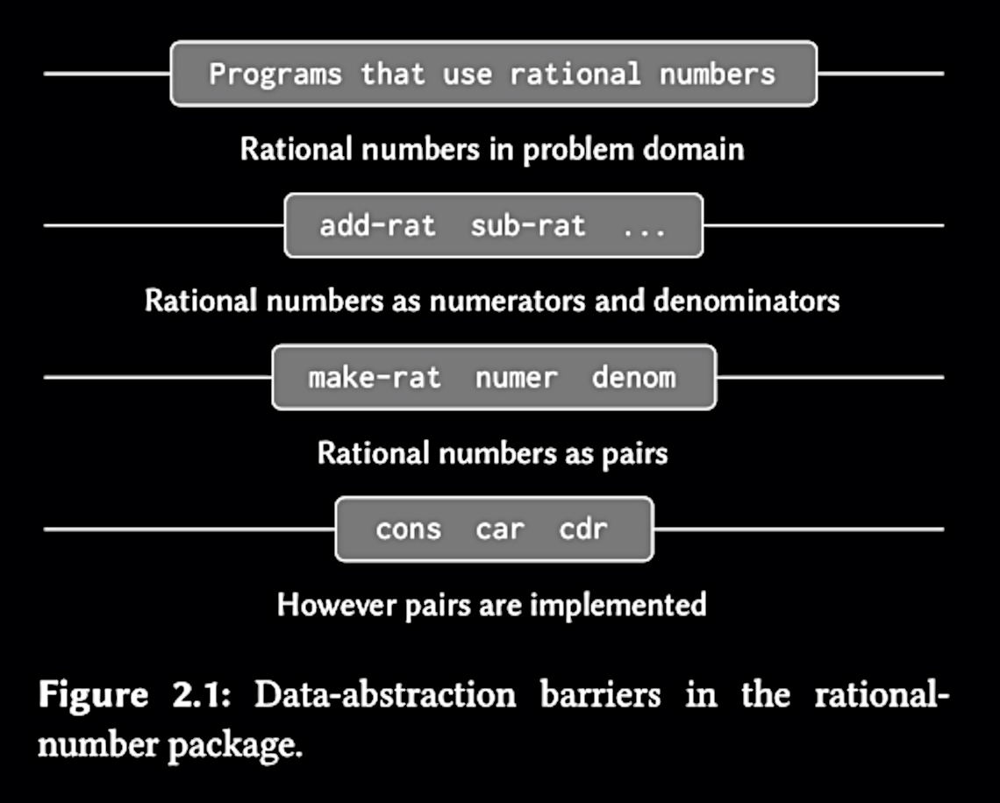

# SICP Note 2.1
## 2 - Building Abstractions with Data
- The title of the first chapter was “Building abstractions with procedures”.  
- So the main topic changed from procedure to data.  

> In this chapter we are going to look at more complex data … we turn in this chapter to another key aspect of any programming language: the **means it provides for building abstractions by combining data objects to form compound data**.  

&nbsp;&nbsp;&nbsp;&nbsp;&nbsp;&nbsp;&nbsp;&nbsp;Q. Why do we need to form compound data?  

> For the same reasons that we want compound procedures: to elevate the conceptual level at which we can design our programs, to increase the modularity of our designs, and to enhance the expressive power of our language.  

By using compound data, we can:  
1. Elevate the level of abstractions while designing the program.  
2. Increase modularity of program designs.  
3. Enhance expressive power of the language.  

- So basically what we can achieve are same as compound procedures.  

> The general technique of isolating the parts of a program that deal with how data objects are represented from the parts of a program that deal with how data objects are used is a powerful design methodology called **data abstraction.**  

- **Data abstraction: Separating data representation and data usage**  

&nbsp;&nbsp;&nbsp;&nbsp;&nbsp;&nbsp;&nbsp;&nbsp;Q. What is “expressive power” of the language?  

> … This same example shows why it is important that our programming language provide the **ability to manipulate compound objects directly**: Without this, there is no way for a procedure such as linear-combination to pass its arguments along to add and mul **without having to know their detailed structure.**  

- I think it means we only concern about the expression of the logic, and give much less attention to how the logic actually works.  
- In short, “expressive power” of the language is what the language provides as means of abstraction.  

> We will see that the key to forming compound data is that a programming language should provide some kind of **glue** so that data objects can be combined to form more complex data objects.  

Introduction to data abstraction and abstraction barriers -> Different ways to form compound data -> key ideas (closure, conventional interfaces) -> symbolic expressions -> generic operations -> data-directed programming  

###### Summary
- We covered compound data and its advantages, that are analogous to compound procedure.  
- We also saw a brief overview of part 2.  

## 2.1 Introduction to Data Abstraction
> … we could make an abstraction that would **separate the way the procedure would be used from the details of how the procedure would be implemented in terms of more primitive procedures.** The analogous notion for compound data is called **data abstraction**.  
> The basic idea of data abstraction is to structure the programs that are to use compound data objects so that they operate on “abstract data” …  

### Chapter 2.1.1 Example: Arithmetic Operations for Rational Numbers

> Let us begin by assuming that we already have a way of construct- ing a rational number from a numerator and a denominator. We also assume that, given a rational number, we have a way of extracting (or selecting) its numerator and its denominator. Let us further assume that the constructor and selectors are available as procedures:  
```scheme
; Constructor
(make-rat <n> <d>)
; Selectors
(numer <x>)
(denom <x>)
```

> We are using here a powerful strategy of synthesis: **wishful thinking**.  

&nbsp;&nbsp;&nbsp;&nbsp;&nbsp;&nbsp;&nbsp;&nbsp;Q. Wishful thinking?  

- Assume some parts of the system already exist. Even if we didn’t implemented yet, we can make further procedural abstractions based on assumptions.  
- I feel this concept is similar to what Interface do, in OOP. With interface we only defines the structure - what is needed, what is returned, …  

> To enable us to implement the concrete level of our data abstraction, our language provides a compound structure called a pair, which can be constructed with the primitive procedure `cons`. This procedure takes two arguments and returns a compound data object that contains the two arguments as parts. Given a pair, we can extract the parts using the primitive procedures `car` and `cdr`.  

- Pair is a compound data structure, which can be constructed by the *primitive* procedure `cons`  
- We can access the elements of the pair using the primitive procedures `car`, `cdr`.  

> The single compound-data primitive `pair`, implemented by the procedures `cons`, `car`, and `cdr`, is the only glue we need. Data objects constructed from pairs are called list-structured data.  

With pairs, we can readily implement `make-rat`, `numer`, and `denom` as follows:  
```scheme
(define (make-rat n d) (cons n d))
(define (numer x) (car x))
(define (denom x) (cdr x))
```

We can change the behavior of further procedures like additions or multiplication, without modifying the procedure, by changing `make-rat`:  
```schemme
(define (make-rat n d)
  (let ((g (gcd dn d)))
    (cons (/ n g) (/ d g))))
```

<br>

###### Exercise 2.1

> Define a better version of `make-rat` that handles both positive and negative arguments.  

```scheme
(define (make-rat n d)
  (let ((num (if (< (* n d) 0)
                 (- (abs n))
                 (abs n)))
        (den (abs d)))
    (let ((g (gcd num den)))
      (cons (/ num g) (/ den g)))))
```

<br>

### Chapter 2.1.2 Abstraction Barriers

> In general, the underlying idea of data abstraction is to identify for each type of data object a basic set of operations in terms of which all manipulations of data objects of that type will be expressed, and then to use only those operations in manipulating the data.  

- Key idea: Define some set of operations to manipulate the data for a data object, and then use only those operations.  

> We can envision the structure of the rational-number system as shown in Figure 2.1.


> The horizontal lines represent **abstraction barriers** that isolate different **levels** of the system. At each level, the barrier separates the programs (above) that use the data abstraction from the programs (below) that implement the data abstraction.  
> Programs that use rational numbers manipulate them solely in terms of the procedures supplied “for public use” by the rational-number package …  
> In effect, procedures at each level are the **interfaces** that define the abstraction barriers and connect the different levels.  

- **The barrier separates the program that use the data abstraction from the programs that implement the data abstraction**  
- It reminds me clean architecture. Is clean architecture - layered architecture also forms an abstraction barriers between layers? My answer: Of course! Each layer defines an interface, and another module which depends on the previous module implements that interface. In this case, the first layer uses the abstraction, and the latter implements the abstraction.  
- Procedures are interfaces that 1) define the abstraction barriers and 2) connect the different levels.  

> This simple idea has many advantages. One advantage is that it makes programs much easier to maintain and to modify. Any complex data structure can be represented in a variety of ways with the primitive data structures provided by a programming language.  
> Of course, the choice of representation influences the programs that operate on it; thus if the representation were to be changed at some later time, all such programs might have to be modified accordingly. This task could be time-consuming and expensive in the case of large programs unless **the dependence on the representation were to be confined by design to a very few program modules**.  

- We can get an advantage of data abstraction by constraining the dependence on the representation to a few interface procedures.  

&nbsp;&nbsp;&nbsp;&nbsp;&nbsp;&nbsp;&nbsp;&nbsp;Q. What is “dependence on the representation”?  

- Let’s clarify the terms. “Representation” means the representation of compound data - how the data is implemented.  
- So constraining dependence on the representation means you should make few parts of the system depend on the implementation of compound data.  
- Although there are no OOP concepts like inheritance or interface, we can make a system that is highly modularized, and easy to be modified.  
- It is shown as strategy pattern, in terms of design patterns.  

<br>

###### Exercise 2.2

First we need constructor and selector procedures for both point and segment. This can be done simply by referring each procedure to primitive procedures:  
```
(define make-segment cons)
(define start-segment car)
(define end-segment cdr)
(define make-point cons)
(define x-point car)
(define y-point cdr)
```

Then we can implement `midpoint-segment` using the constructors and the selectors above, with additional operations on top of them:  
```scheme
(define (add-point p1 p2)
  (make-point (+ (x-point p1) (x-point p2))
              (+ (y-point p1) (y-point p2))))
(define (div-point p num)
  (make-point (/ (x-point p) num)
              (/ (y-point p) num)))
(define (midpoint-segment line)
  (let ((start (start-segment line))
        (end (end-segment line)))
    (div-point (add-point start end) 2)))
```

<br>

###### Exercise 2.3

> Implement a representation for rectangles in a plane. In terms of your constructors and selectors, create procedures that compute the perimeter and the area of a given rectangle.  
> Now implement a different representation for rectangles. Can you design your system with suitable abstraction barriers, so that the same perimeter and area procedures will work using either representation?  

First let’s implement the representation for rectangles using two points - top-left, and bottom-right. In this case, the constructor is easily defined but selectors are a little bit complicated:  
```scheme
(define (sub-point p1 p2)
  (make-point (- (x-point p1) (x-point p2))
              (- (y-point p1) (y-point p2))))
(define (make-rect p1 p2) (cons p1 p2))
(define (width-rect r)
  (abs (x-point (sub-point (car r) (cdr r)))))
(define (height-rect r)
  (abs (y-point (sub-point (car r) (cdr r)))))
```

Procedures that compute perimeter and area are like this:  
```scheme
(define (perimeter-rect r)
  (+ (* 2 (width-rect r))
     (* 2 (height-rect r))))
(define (area-rect r)
  (* (width-rect r) (height-rect r)))
```

The procedures above (perimeter and area) remain unchanged even if constructor and selector changes - the representation of rectangle changes.  
Maybe we can represent a rectangle with a top-left point, width and height:  
```scheme
(define (make-rect p w h) (cons (cons w h) p))
(define (width-rect r) (car (car r)))
(define (height-rect r) (cdr (car r)))
```

<br>

### Chapter 2.1.3

> But exactly what is meant by data? It is not enough to say “whatever is implemented by the given selectors and constructors.” Clearly, not every arbitrary set of three procedures can serve as an appropriate basis for the rational-number implementation.  

- So what is DATA? What characterizes the selectors and constructors in terms of data objects?  

> … `make-rat`, `numer`, and `denom` must satisfy the condition that, for any integer n and any non-zero integer d, if x is `(make-rat n d)`, then `(numer x) / (denom x)` = `n / d`. In fact, this is the only **condition** `make-rat`, `numer` and `denom` **must fulfill** in order to form a suitable basis for a rational-number representation.  

- There’s a condition to fulfill in order to form a data object.  

> In general, we can think of data as **defined by some collection of selectors and constructors**, together **with specified conditions** that these procedures must fulfill in order to be a valid representation.  
> This point of view can serve to define not only “high-level” data objects, such as rational numbers, but lower-level objects as well … the only thing we need to know about these three operations is that if we glue two objects together using `cons` we can retrieve the objects using `car` and `car`. That is, the operations satisfy the condition that, for any objects `x` and `y`, if `z` is `(cons x y)` then `(car z)` is `x` and `(cdr z)` is `y`.  

```scheme
(define (cons x y)
  (define (dispatch m)
    (cond ((= m 0) x)
          ((= m 1) y)
          (else (error "Argument not 0 or 1: CONS" m))))
    dispatch)
(define (car z) (z 0))
(define (cdr z) (z 1))
```

- What’s surprising to me is the fact that **data** is defined in terms of selectors and constructors - the procedures. When we first think of data, we usually imagine some model class or database table, persistence storage.  
- Also this statements looks like the concepts of product in Category theory: “for any objects `x` and `y`, if there’s an object `z` that fulfills some structure - pattern beneath it, then `z` is something.”  
- What’s unclear is the condition. which condition makes the representation valid? Let’s discuss further by reviewing the following quotes:  

> In general, abstract models define new kinds of data objects in terms of previously defined types of data objects. **Assertions about data objects can therefore be checked by reducing them to assertions about previously defined data objects**.  

- Reducing assertions about high-level abstractions to assertions about low-level abstractions…  
- Then the conditions can be anything???  
- Let’s think of rational numbers. Unlike just a pair or a point in coordinates, there’s special relationship between denominator and numerator. What about exponentiation? If we want to model exponentiation, then the resulting selectors and numerators must meets the conditions: `(base e)^(exp e) = base^e`  
- So.. the condition gives a context or a meaning to the object by making constraints between them, or identifying some patterns between them.  

> The subtle point to notice is that the value returned by `(cons x y)` is a procedure - namely the internally defined procedure `dispatch`, which takes one argument and return either `x` or `y` depending one whether the argument is 0 or 1 … if we access pairs using only `cons`, `car`, and `cdr` we cannot distinguish this implementation from one that uses “real” data structures.  
> The procedural representation, although obscure, is a perfectly adequate way to represent pairs, since it fulfills the only conditions that pairs need to fulfill. This style of programming is often called **message passing**.  

&nbsp;&nbsp;&nbsp;&nbsp;&nbsp;&nbsp;&nbsp;&nbsp;Q. Why “message passing”?  

- Take a closer look at the definition of `cons` above. The internal procedure `dispatch` make a state machine for 0 and 1. the number 0 and 1 doesn’t have any meaning themselves, unless it is used as a sign or signal. I don’t know exact definition of *message*, but I guess “message” comes from the reasons above.  

<br>

###### Exercise 2.4

> Verify that `(car (cons x y))` yields `x` for any objects `x` and `y`.  
```scheme
(define (cons x y)
  (lambda (m) (m x y)))
(define (car z)
  (z (lambda (p q) p)))
```

- Let’s use substitution model to evaluate the expression `(car (cons x y))`:  
```scheme
(car (cons x y))
(car (lambda (m) (m x y)))
((lambda (m) (m x y)) (lambda (p q) p))
((lambda (p q) p) x y)
x
```

> What is the corresponding definition of `cdr`?  

- We can easily yield `cdr` procedure from the definition of `car`:  
```scheme
(define (cdr z)
  (z (lambda (p q) q)))
```

<br>

###### Exercise 2.5

> Show that we can represent pairs of nonnegative integers using only numbers and arithmetic operations if we represent the pair `a` and `b` as the integer that is the product `2^a * 3^b` . Give the corresponding definitions of the procedures cons, car, and cdr.  

- Defining a constructor procedure is straightforward, but when it comes to selectors, it may seem confusing at first glance. We can use the fact that 2 and 3 are coprimes.  
```scheme
(define (cons a b)
  (* (expt 2 a) (expt 3 b)))
(define (car z)
  (define (f value depth)
    (if (= (remainder value 2) 0)
        (f (/ value 2) (+ depth 1))
        depth))
  (f z 0)))
(define (cdr z)
  (define (f value depth)
    (if (= (remainder value 3) 0)
        (f (/ value 3) (+ depth 1))
        depth))
  (f z 0)))
```

- We can further extract the common patterns from the selectors like this:  
```scheme
(define (product-access-with-base base)
  (lambda (z)
    (define (f value depth)
      (if (= (remainder value base) 0)
          (f (/ value base) (+ depth 1))
          depth))
    (f z 0)))
(define (car z) ((product-access-with-base 2) z))
(define (cdr z) ((product-access-with-base 3) z))
```

<br>

###### Exercise 2.6

> In case representing pairs as procedures wasn’t mind-boggling enough, consider that, in a language that can manipulate procedures, we can get by without numbers (at least insofar as nonnegative integers are concerned) by implementing 0 and the operation of adding 1 as:  
```scheme
(define zero (lambda (f) (lambda (x) x)))
(define (add-one n)
  (lambda (f) (lambda (x) (f ((n f) x)))))
```
> This representation is known as **Church numerals**, after its inventor, Alonzo Church, the logician who invented the Lambda calculus.  

> Define `one` and `two` directly.  

- We can define them in terms of `zero` and `add-one`, but the author says “directly”. How can it be possible?  
- We should define `one` directly, and check `(add-one zero)` is equal to `one` - This is the condition that needs to be fulfilled in order to make a valid representation.  
```scheme
(define one (lambda (f) (lambda (x) (f x))))
```

- How can we compare the returned value of these procedures? Maybe we should check if the retuned procedures yields the same result for the same input.  
- Here’s how it works with a simple function that adds 1 to the input:  
```scheme
(define (func x) (+ x 1))
((zero func) 4) ; 4
(((add-one zero) func) 4) ; 5
((one func) 4) ; 5
```

- We can define `two` in a similar way:  
```scheme
(define two (lambda (f) (lambda (x) (f (f x)))))
(((add-one one) func) 4) ; 6
((two func) 4) ; 6
```

> Give a direct definition of the addition procedure +.  

- I can give a definition, but I can’t explain why it looks like this..  
```scheme
(define (add a b)
  (lambda (f) (lambda (x) ((a f) ((b f) x)))))
```

[Church encoding - Wikipedia](https://en.wikipedia.org/wiki/Church_encoding)  

<br>

### Chapter 2.1.4 Extended Exercise: Interval Arithmetic

- Additional exercises are provided in this chapter.  

<br>

###### Exercise 2.7

> Define selectors `upper-bound` and `lower-bound` to complete the implementation.  

```scheme
(define (make-interval a b) (cons a b))
```
- Given the definition of `make-interval` above, defining selectors is straightforward:  
```scheme
(define (lower-bound z) (car z))
(define (upper-bound z) (cdr z))
```

<br>

###### Exercise 2.8

> Using reasoning analogous to Alyssa’s, describe how the difference of two intervals may be computed. Define a corresponding subtraction procedure, called sub-interval.  

- We can reason the lower bound of the difference is the difference between the lower bound of the first and the upper bound of the second.  
- The upper bound of the difference is the opposite. It is the difference between the upper bound of the first and the lower bound of the second.  
- This could be implemented like this:  
```scheme
(define (sub-interval x y)
  (make-interval (- (lower-bound x) (upper-bound y))
                 (- (upper-bound x) (lower-bound y))))
```

<br>

###### Exercise 2.9

> The width of an interval is half of the difference between its upper and lower bounds.   
> Show that the width of the sum (or difference) of two intervals is a function only of the widths of the intervals being added (or subtracted). Give examples to show that this is not true for multiplication or division.  

- First, let’s define the procedure `width-interval`:  
```scheme
(define (width-interval z)
  (/ (abs (- (lower-bound z) (upper-bound z))) 2.0))
```

- How can we evaluate the following expression? (Assuming `x` and `y` are predefined intervals):  
```scheme
(width-interval (add-interval x y))
(width-interval (make-interval (+ (lower-bound x) (lower-bound y))
                               (+ (upper-bound x) (upper-bound y))))
(/ (abs (- (+ (lower-bound x) (lower-bound y)) (+ (upper-bound x) (upper-bound y)))) 2.0)

; This is same as:
(+ (/ (abs (- (lower-bound x) (upper-bound x))) 2.0) (/ (abs (- (lower-bound y) (upper-bound y))) 2.0))

; Which is:
(+ (width-interval x) (width-interval y))

; In a similar way, the width of the difference of two intervals is:
(/ (abs (- (- (lower-bound x) (upper-bound y)) (- (upper-bound x) (lower-bound y)))) 2.0)

; Which is also:
(+ (width-interval x) (width-interval y))
```

<br>

###### Exercise 2.10

> It is not clear what it means to divide by an interval that spans zero. Modify `div-interval` to check for the condition, and to signal an error if it occurs.  

- Assume that you have an interval, [0, 1]. There’s no way to define a division for zero as a denominator. Also, how can divide by an interval [-1, 1]?  
- Raising an error when the interval spans zero - that means, the interval contains zero within the range.  
```scheme
(define (div-interval-imp x y) 
  (if (or (= (upper-bound y) 0) 
          (= (lower-bound y) 0) 
          (< (* (upper-bound y) (lower-bound y)) 0))
      "div by zero error"
      (mul-interval
        x
        (make-interval (/ 1.0 (upper-bound y))
                       (/ 1.0 (lower-bound y))))))
```
- (I don’t know how to raise an error in Scheme)  

<br>

###### Exercise 2.11

> By testing the signs of the endpoints of the intervals, it is possible to break `mol-interval` into nine cases, only one of which requires more than two multiplications.  

- [SICP exercise 2.11 - Drewiki](http://wiki.drewhess.com/wiki/SICP_exercise_2.11)  

<br>

###### Exercise 2.12

> Define a constructor `make-center-percent` that takes a center a percentage tolerance and produces the desired interval. You must also define a selector `percent` that produces the percentage tolerance for a given interval.  

- With already provided procedures we can easily make it:  
```scheme
(define (make-center-width c w)
  (make-interval (- c w) (+ c w)))
(define (center i)
  (/ (+ (lower-bound i) (upper-bound i)) 2))
(define (width i)
  (/ (- (upper-bound i) (lower-bound i)) 2))

(define (make-center-percent c p)
  (let ((dist (* c p)))
    (make-interval (- c dist) (+ c dist))))
(define (percent i)
  (/ (width i) (center i)))
```

<br>

###### Exercise 2.13

> Show that under the assumption of small percentage tolerances there is a simple formula for the approximate percentage tolerance of the product of two intervals in terms of the tolerances of the factors. You may simplify the problem by assuming that all numbers are positive.   

- If you assume that all numbers are positive, we can represent the product of two intervals in terms of bounds of them:  
```
[n1, n2] * [n3, n4] = [n1 * n3, n2 * n4]
```

- If you rewrite the above expression in terms of center and percentage, you can get:  
```
[(1 - p1) * c1, (1 + p1) * c1] * [(1 - p2) * c2, (1 + p2) * c2] =
[(1 - p1)(1 - p2) * c1 * c2, (1 + p1)(1 + p2) * c1 * c2]

(1 - p1)(1 - p2) = 1 - p1 - p2 + p1 * p2
(1 + p1)(1 + p2) = 1 + p1 + p2 + p1 * p2
```

- Both lower and upper bounds have `c1 * c2`. We can consider this is the center of the product.  
- In “percentage” part, you can see that both have `1 + p1 * p2`. If we assume `p1` and `p2` are small so their product is pretty small and it doesn’t affect the overall tolerance at all, then we can ignore `p1 * p2`.  
- In conclusion, here’s a simple formula for a tolerance of the product of two intervals, in terms of the tolerances of the factors:  
```
p = p1 + p2 (Simply their sum)
```

