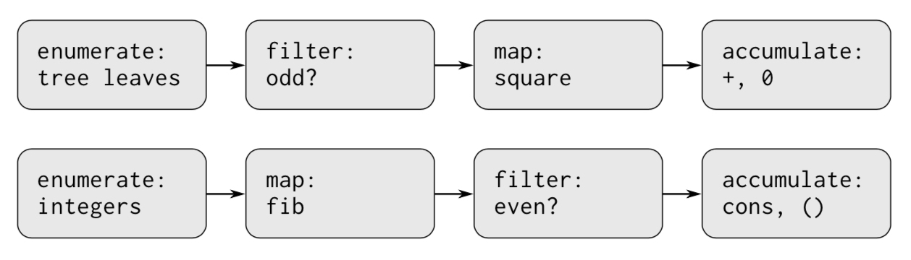

# SICP Note 2.2
### Hierarchical Data and the Closure Property

> As a consequence, pairs pro- vide a universal building block from which we can construct all sorts of data structures.  

> The ability to **create pairs whose elements are pairs** is the essence of list structure’s importance as a representational tool. We refer to this ability as the **closure property** of `cons`.   
> In general, an operation for combining data objects satisfies the closure property if the results of combining things with that operation can themselves be combined using the same operation.  

> Closure is the key to power in any means of combination, because it permits us to create **hierarchical structures** - structures made up of parts, which themselves are made up of parts, and so on.  

&nbsp;&nbsp;&nbsp;&nbsp;&nbsp;&nbsp;&nbsp;&nbsp;Q. How is it different from the usual “closure” that we know?  

> The use of the word “closure” here comes from abstract algebra, where a set of elements is said to be closed under an operation if applying the operation to elements in the set produces an element that is again an element of the set.  
> The Lisp community also uses the word “closure” to describe a totally unrelated concept: A closure is an implementation technique for representing procedures with free variables.  

- So there it is. The word “closure” in the second context, does not really mean any sort of concepts.  

&nbsp;&nbsp;&nbsp;&nbsp;&nbsp;&nbsp;&nbsp;&nbsp;Q. Seems like we’ve already seen the closure property in part 1. Is there any relation between compound procedures and the closure property?  

> From the outset of Chapter 1, we’ve made essential use of closure in dealing with procedures, because all but the very simplest programs rely on the fact that the elements of a combination can themselves be combinations.  

- We’ve already used it! Combination - a compound procedure is one of the examples of the closure property.  

> “It is better to have 100 functions operate on one data structure than to have 10 functions operate on 10 data structures.”  

- This statement is used as a virtue of functional programming. From another perspective, if you can make a new data structure just like any functions, then does this statement exist?  
- The authors make an interesting claim about it.   

<br>

### 2.2.1 Representing Sequences

> One of the useful structures we can build with pairs is a **sequence** - an ordered collection of data objects.  

- It’s a list! How can we make such a list using `cons`?  
- Think about linked list. Each node has its own item and a reference to the next node. By sequentially calling `cons` like this, we can represent a sequence just like linked list:  
```scheme
(cons 1
      (cons 2
            (cons 3
                  (cons 4 nil))))
```

- This could be simplified with `list` primitive:  
```scheme
(list 1 2 3 4)
```

- One thing to note here, is that we should distinguish a `list` which means a chain of pairs from a `list structure` which refers to any data structure made out of pairs.  
- **Any** data structure? I’m confused.  

> Be careful not to confuse the expression `(list 1 2 3 4)` with the list `(1 2 3 4)`, which is the result obtained when the expression is evaluated. Attempting to evaluate the expression `(1 2 3 4)` will signal an error when the interpreter tries to apply the procedure 1 to arguments 2, 3, and 4.   
   
- In the following code snippet…  
```scheme
(list 1 2 3 4)
(1 2 3 4)
```
- **The former expression produces the latter expression.**  

<br>

###### Exercise 2.17

> Define a procedure `last-pair` that returns the list that contains only the last elements of a given list.  

Expected result:  
```scheme
(last-pair (list 1 2 3 4 5))
(5)
```

- Let’s ignore the case where the list is empty.  
- How can we detect “the end of the list”?  
1. Apply `cdr` to the list.  
2. If it is empty, return the result of applying `car` to the list.  
3. If it is not empty, return last pair of the result of applying `car` to the list.  
```scheme
(define (last-pair items)
  (let ((left (cdr items)))
    (if (null? left)
        (car items)
        (last-pair left))))
```

<br>

###### Exercise 2.18

> Define a procedure `reverse` that takes a list as argument and returns a list of the same elements in reverse order:  

Expected result:  
```scheme
(reverse (list 1 4 9 16 25))
(25 16 9 4 1)
```

- We need `car` to take the first element of the list, `cdr` to pass the remainder of the list, and `cons` to combine the element in reverse order.  

```scheme
(define (reverse items)
  (define (f input output)
    (if (null? input)
      output
      (f (cdr input) (cons (car input) output))))
  (f items (list)))
```
(I think It’s easier to come up with iterative solution in this case.)  


###### Exercise 2.19

> We want to rewrite the procedure `cc` so that its second argument is a list of the values of the coins to use rather than an integer specifying which coins to use.  

Old version:  
```scheme
; Recall from Chapter 1.2.2
(define (count-change amount) (cc-old amount 5))
(define (cc-old amount kinds-of-coins)
  (cond ((= amount 0) 1)
        ((or (< amount 0) (= kinds-of-coins 0)) 0) 
        (else (+ (cc-old amount 
                         (- kinds-of-coins 1))
                 (cc-old (- amount
                            (first-denomination
                             kinds-of-coins))
                         kinds-of-coins)))))
(define (first-denomination kinds-of-coins)
  (cond ((= kinds-of-coins 1) 1) 
        ((= kinds-of-coins 2) 5)
        ((= kinds-of-coins 3) 10)
        ((= kinds-of-coins 4) 25)
        ((= kinds-of-coins 5) 50)))
```
- Back in Chapter 1.2.2, we didn’t realized but the procedure `first-denomination` was actually a selector for some hidden data structure.  
- There’s no constructor procedure, though. It’s because the data structure is fixed with the definition of the procedure.  

So what we’re going to do is to reveal the hidden data structure, and implement corresponding constructor and selector procedures in terms of list.  

- First, replace the definition of the procedure `first-denomination` with an application of `list` primitive:  
```scheme
; Old
(define (first-denomination kinds-of-coins)
  (cond ((= kinds-of-coins 1) 1) 
        ((= kinds-of-coins 2) 5)
        ((= kinds-of-coins 3) 10)
        ((= kinds-of-coins 4) 25)
        ((= kinds-of-coins 5) 50)))

; New
(define us-coins (list 50 25 10 5 1))
```

- Next, replace the condition for the existence of remaining coins with `null?` primitive:  
```
; Old
(= kinds-of-coins 0)

; New
(null? coins)
```

- Next, replace the application of the procedure `first-denomination` with the application of `car` primitive:  
```scheme
; Old
(define (cc amount kinds-of-coins) ...
  (first-denomination kinds-of-coins)

; New
(define (cc amount coins) ...
  (car coins)
```

- Next, replace the subtraction of `kinds-of-coins` with the application of `cdr` primitive:  
```scheme
; Old 
(- kinds-of-coins 1)

; New
(cdr coins)
```

- Resulting new version of `cc`, along with other auxiliary procedures:  
```scheme
(define (cc amount coins)
  (cond ((= amount 0) 1)
        ((or (< amount 0) (no-more? coins)) 0) 
        (else (+ (cc amount 
                     (except-first-denomination coins))
                 (cc (- amount
                        (first-denomination
                         coins))
                     coins)))))

(define no-more? null?)
(define except-first-denomination cdr)
(define first-denomination car)
```

> Does the order of the list `coin` affect the answer produced by `cc`? Why or why not?  

- It doesn’t matter. I guess it’s because no matter how the order of the list is, we always fully iterate the whole list and they are completely independent of each others.  

<br>

###### Exercise 2.20

> Write a procedure `same-parity` that takes one or more integers and returns a list of all the arguments that have the same even-odd parity as the first argument.  

```scheme
(define (filter l condition)
  (if (null? l)
      l
      (if (condition (car l))
          (cons (car l) (filter (cdr l) condition))
          (filter (cdr l) condition))))

(define (same-parity first . rest)
  (let ((condition (if (even? first)
                       even?
                       odd?)))
    (cons first (filter rest condition))))
```

<br>

###### Mapping over lists

> One extremely useful operation is to apply some transformation to each element in a list and generate the list of results. … We can abstract this general idea and capture it as a common pattern expressed as a higher-order procedure.  

```scheme
(define (map proc items)
  (if (null? items)
    nil
    (cons (proc (car items))
          (map proc (cdr items)))))
```

> `map` is an important construct, not only because it captures a common pattern, but because it establishes a **higher level of abstraction** in dealing with lists.  

- In terms of `map`, we don’t give an attention to each element, and emphasize some transformation is applied to the list.  

> The difference between the two definitions is not that the computer is performing a different progress, but that **we think about the process differently**. In effect, map helps establish an **abstraction barrier** that isolates the implementation of procedures that transform lists from the details of how the elements of the list are extracted and combined.   

<br>

###### Exercise 2.21

> The procedure `square-list` takes a list of numbers as argument and returns a list of the squares of those numbers.  

```scheme
(square-list (list 1 2 3 4))
(1 4 9 16)
```

- Two different definitions (Assume that we already have the procedure `square`):  
```scheme
(define (square-list items)
  (if (null? items) 
      nil 
      (cons (square (car items)) (cdr items))))
(define (square-list items) 
  (map square items))
```

<br>

###### Exercise 2.22

```scheme
(define (square-list items)
  (define (iter things answer) 
    (if (null? things)
         answer 
         (iter (cdr things)
               (cons (square (car things))
                     answer))))
  (iter items nil))
```

> Unfortunately, defining `square-list` this way produces the answer list in the reverse order of the one desired. Why?  

- For every step, we combine the square of the element in the original list with the previous results (`answer`). Because it passes the argument `answer` to the second parameter of `cons`, former results appears later and latter results appears earlier in the list.  

```scheme
(define (square-list items)
  (define (iter things answer) 
    (if (null? things)
         answer 
         (iter (cdr things)
               (cons answer
                     (square (car things))))))
  (iter items nil))
```

- This version doesn’t work either. It doesn’t form a valid sequence of pairs.  
- List has a structure like this: `(a1 (a2 (... (an nil)`  
- The above procedure forms a structure like this: `(((... (nil an) ...) a2) a1)`  

<br>

###### Exercise 2.23

```scheme
(define (for-each f items)
  (cond ((null? items) #t)
        (else (f (car items))
              (for-each f (cdr items)))))
```

<br>

### Chapter 2.2.2 Hierarchical Structures

> The representation of sequences in terms of lists generalizes naturally to represent sequences whose elements may themselves be sequences.  

> Another way to think of sequences whose elements are sequences is as **trees**. The elements of the sequence are the branches of the tree, and elements that are themselves sequences are subtrees.  

> Recursion is a natural tool for dealing with tree structures, since we can often reduce operations on trees to operations on their branches, which reduce in turn to operations on the branches of the branches, and so on, until we reach the leaves of the tree.   

- Divide and conquer?  

`count-leaves` procedure which computes total count of the leaves of the tree:  
```
(define (count-leaves x)
  (cond ((null? x) 0)                        ; Empty list: 0
        ((not (pair? x)) 1)                  ; Leaf case: 1
        (else (+ (count-leaves (car x))      ; Other: car + cdr
                 (count-leaves (cdr x))))))
```

<br>

###### Exercise 2.25

> Give combinations of `cars` and `cdrs ` that will pick 7 from each of the following lists:  

```scheme
(1 3 (5 7) 9)
; (car (cdr (car (cddr a)))) 
((7))
; (car (car a))
(1 (2 (3 (4 (5 (6 7)))))
; (car (cdr (car (cdr (car (cdr (car (cdr (car (cdr (car (cdr a))))))))))))
```

<br>

###### Exercise 2.26

> Suppose we define x and y to be two lists:  
```scheme
(define x (list 1 2 3)) 
(define y (list 4 5 6))
```

> What result is printed by the interpreter in response to evaluating each of the following expressions:   
```scheme
(append x y)
; (1 2 3 4 5 6)
(cons x y)
; ((1 2 3) 4 5 6)
(list x y)
; ((1 2 3) (4 5 6))
```

<br>

###### Exercise 2.27

> Modify your `reverse` procedure of Exercise 2.18 to produce a `deep-reverse` procedure that takes a list as args ent and returns as its value the list with its elements reversed and with all sublists deep-reversed as well.  

```scheme
(define (deep-reverse items)
  (define (f input output)
    (cond ((null? input) output)
          ((not (pair? input)) input)
          (else (f (cdr input) (cons (deep-reverse (car input)) output)))))
  (f items (list)))
```

<br>

###### Exercise 2.28

> Write a procedure `fringe` that takes as argument a tree (represented as a list) and returns a list whose elements are all the leaves of the tree arranged in left-to-right order.   

1. The value for empty list is an empty list.  
2. When we reach actual leaves, we should append it to the output which is made so far.  
3. In reduction step, first we visit left side, and then visit right side  

- ~~By doing this, we can get the reverse of the desired result. Simply applying `reverse` procedure to fix this. (We don’t have to take into hierarchical structure, because the result of `fringe` is already flat.)~~  
- There’s no need to use `reverse` at all, if we visit the right side first.  

```scheme
; With reverse
(define (fringe items)
  (define (f input output)
    (cond ((null? input) output)
          ((not (pair? input)) (cons input output))
          (else (f (cdr input) (f (car input) output)))))
  (reverse (f items (list))))

; Without reverse
(define (fringe items)
  (define (f input output)
    (cond ((null? input) output)
          ((not (pair? input)) (cons input output))
          (else (f (car input) (f (cdr input) output)))))
  (f items (list)))
```

<br>

###### Exercise 2.29

- Given the following constructors…  
```scheme
(define (make-mobile left right)
  (list left right))
(define (make-branch length structure)
  (list length structure))
```

Answer the questions in 151p:  
```scheme
; 2.29 - a
(define (left-branch mobile) (car mobile))
(define (right-branch mobile) (cadr mobile))
(define (branch-length branch) (car branch))
(define (branch-structure branch) (cadr branch))

; 2.29 - b
(define (total-weight entity)
  (cond ((null? entity) 0)
        ((not (pair? entity)) entity)
        ((not (pair? (branch-structure entity))) (branch-structure entity))
        (else (+ (total-weight (left-branch entity)) ; Mobile
                 (total-weight (right-branch entity))))))

; 2.29 - c
(define (torque branch)
  (* (branch-length branch) 
     (total-weight (branch-structure branch))))

(define (balanced? mobile)
  (cond ((null? mobile) #f)
        ((not (pair? mobile)) #t)
        (else (and (= (torque (left-branch mobile)) (torque (right-branch mobile)))
                   (balanced? (branch-structure (left-branch mobile)))
                   (balanced? (branch-structure (right-branch mobile)))))))
```

> Suppose we change the representation of mobiles so that the constructors now use `cons` instead of `list`. How much do you need to change your programs to convert to the new representation?  

The main difference between those two is either the second element is a pair or not. So all we need to do, is to change the selectors - `right-branch`, and `branch-structure`. Because we use selectors for accessing elements in compound data, the implementation detail - in this case, “how to get the elements out of the data structure” is hidden.  

<br>

###### Mapping over trees

> Just as `map` is a powerful abstraction for dealing with sequences, `map` together with recursion is a powerful abstraction for dealing with trees.   

> The recursive plan for `scale-tree` is similar to the one for `count-leaves`:  
```scheme
(define (scale-tree tree factor) 
  (cond ((null? tree) nil)
        ((not (pair? tree)) (* tree factor))
        (else (cons (scale-tree (car tree) factor)
                    (scale-tree (cdr tree) factor)))))
```

> Another way to implement `scale-tree` is to **regard the tree as a sequence of sub-trees** and use `map`. We map over the sequence, scaling each sub-tree in turn, and return the list of results. In the base case, where the tree is a leaf, we simply multiply by the factor:  
```scheme
(define (scale-tree-map tree factor)
  (map (lambda (sub-tree)
         (if (pair? sub-tree)
             (scale-tree-map sub-tree factor)
             (* sub-tree factor)))
       tree))
```

<br>

###### Exercise 2.30

> Define a procedure `square-tree` analogous to the `square-list` procedure in Exercise 2.21:  
```scheme
; direct solution
(define (square-tree tree)
  (cond ((null? tree) '())
        ((not (pair? tree)) (square tree))
        (else (cons (square-tree (car tree))
                    (square-tree (cdr tree))))))

; map solution
(define (square-tree-map tree)
  (map (lambda (sub-tree)
         (if (pair? sub-tree)
             (square-tree-map sub-tree)
             (square sub-tree)))
       tree))
```

<br>

###### Exercise 2.31

> Abstract your answer to Exercise 2.30 to produce a procedure `tree-map` with the property that `square-tree` could be defined as:  
```scheme
(define (square-tree tree) (tree-map square tree))
```

- Let’s start taking common patterns from the previous two procedures - `scale-tree-map`, and `square-tree-map`. Then parameterize changing parts.  
```scheme
(define (tree-map f tree)
  (map (lambda (sub-tree)
         (if (pair? sub-tree)
             (tree-map f sub-tree)
             (f sub-tree)))
       tree))
```

<br>

###### Exercise 2.32

> We can represent **a set** as **a list of distinct elements**, and we can represent **the set of all subsets of the set** as **a list of lists**.  
> For example, if the set is `(1 2 3)`, then the set of all subsets is `(() (3) (2) (2 3) (1) (1 3) (1 2) (1 2 3))`.  
> Complete the following definition of a procedure that generates the set of subsets of a set and give a clear explanation of why it works:  
```scheme
(define (subsets s)
  (if (null? s)
      (list '())
      (let ((rest (subsets (cdr s))))
        (append rest (map (??) rest)))))
```

1. Let’s start with the simplest problem. How to calculate the all subsets of `(3)`?  
```scheme
; First pass (3) to subset.
(subsets (3))
; Cause it's not null, the variable rest becomes the subsets of () - which is ().
(let ((rest (subsets (cdr s)))) ; rest = ()
; What makes it to be `(() (3))`?
(append '() (map <??> '()))
```

2. Let’s look at a different perspective. What should be added to the list of all subsets, when the original set becomes `(2 3)`? We already have `(), (3)` so `(2), (2 3)` is needed. It clearly shows some patterns it it:  
```
When an additional element is added to the set, we also get new subsets that adds new element on existing subsets.
```

So the following statement must produce `(() (3) (2) (2 3))`. Especially, `map` part should generate `((2) (2 3))` from `(() (3))`  
```scheme
(append (list '() (3)) (map <??> (list '() (3))))
```

So the answer is:  
```scheme
(lambda (list) (cons (car s) list))

; Complete procedure
(define (subsets s)
  (if (null? s)
      (list '())
      (let ((rest (subsets (cdr s))))
        (append rest (map (labmda (list) (cons (car s) list))
                          rest)))))
```

<br>

### Chapter 2.2.3 Sequences as Conventional Interfaces

> In working with compound data, we’ve stressed how data abstraction permits us to design programs without becoming enmeshed in the details of data representations, and how abstraction preserves for us the flexibility to experiment with alternative representations.  
> In this section, we introduce another powerful design principle for working with data structures—the use of **conventional interfaces**.  

- We can observe some similarities in the following two procedures:   
```scheme
(define (sum-odd-squares tree)
  (cond ((null? tree) 0)
        ((not (pair? tree))
         (if (odd? tree) (square tree) 0))
        (else (+ (sum-odd-squares (car tree))
                 (sum-odd-squares (cdr tree))))))

(define (even-fibs n)
  (define (next k)
    (if (> k n)
        '()
        (let ((f (fib k)))
          (if (even? f)
              (cons f (next (+ k 1)))
              (next (+ k 1))))))
  (next 0))
```


[image:C6218FFC-2B66-4AF5-8BFA-3D01CBF2B648-28553-000035C7514D4761/C7CB19FA-EB79-4D7B-BAA7-56B4CF05CA2F.png]  

> In `sum-odd-squares`, we begin with an **enumerator**, which generates a “signal” consisting of the leaves of a given tree. This signal is passed through a **filter**, which eliminates all but the odd elements. The resulting signal is in turn passed through a **map**, which is a “transducer” that applies the square procedure to each element. The output of the map is then fed to an **accumulator**, which combines the elements using +, starting from an initial 0. The plan for `even-fibs` is analogous.  

- Unfortunately we can’t apply the signal-flow structure to these procedures directly, because the computations are spread over the program.  
1. Enumeration is implemented partly by the `null?` and `pair?` tests, and partly by the tree-recursive structure.  
2. Accumulation is found partly in the tests and the addition used in the recursion.  

- What’s interesting in here is the fact that by elevating the level of abstraction of the perspective, we can capture an interesting commonalty.  

> If we could organize our programs to make the signal-flow structure manifest in the procedures we write, this would increase the conceptual clarity of the resulting code.  

<br>

###### Sequence Operations

> The key to organizing programs so as to more clearly reflect the signal-flow structure is **to concentrate on the “signals”** that **flow from one stage in the process to the next**.  

&nbsp;&nbsp;&nbsp;&nbsp;&nbsp;&nbsp;&nbsp;&nbsp;Q. What “signals” mean in this context?  

- One important property of signals: “signals flow from one stage in the process to the next”  
- It seems like we can implement signals in many different ways. The author uses list to implement the signals.  
- It reminds me a lot about operators in Rx.  

One of the examples of those procedures is `filter`. We can also implement accumulator and enumerator in a similar way:  
```scheme
(define (filter predicate sequence)
  (cond ((null? sequence) '())
        ((predicate (car sequence))
         (cons (car sequence)
               (filter predicate (cdr sequence))))
        (else (filter predicate (cdr sequence)))))
```

> The value of **expressing programs as sequence operations** is that this helps us make program designs that are modular, that is, designs that are constructed by combining relatively independent pieces. We can encourage modular design by providing a library of standard components together with **a conventional interface for connecting the components in flexible ways** …  
> **Sequences, implemented here as lists, serve as a conventional interface that permits us to combine processing modules.**  

- Conventional interface is used for connecting the components.  
- Sequence is a conventional interface, and is implemented as a list.  

> One of the reasons for the success of Lisp as a programming language is that **lists provide a standard medium for expressing ordered collections** so that they can be manipulated using higher-order operations.   

<br>

###### Exercise 2.33

> Fill in the missing expressions to complete the following definitions of some basic list manipulation operations as accumulations:  
```scheme
(define (map p sequence)
  (accumulate (lambda (x y) (cons (p x) y)) '() sequence))
(define (append seq1 seq2)
  (accumulate cons seq2 seq1))
(define (length sequence)
  (accumulate (lambda (item sum) (+ 1 sum)) 0 sequence))
```

<br>

###### Exercise 2.34

> Evaluating a polynomial in `x` at a given value of `x` can be formulated as an accumulation…  
> Fill in the following template to produce a procedure that evaluates a polynomial using Horner’s rule.  

```scheme
(define (horner-eval x coefficient-sequence)
  (accumulate (lambda (this-coeff higher-terms) 
                (* (+ this-coeff higher-terms) x))
              0
              coefficient-sequence))
```

<br>

###### Exercise 2.35

> Redefine `count-leaves` from Section 2.2.2 as an accumulation:  

```scheme
(define (count-leaves tree)
  (accumulate +
              0
              (map (lambda (t)
                     (cond ((null? t) 0)
                           ((pair? t) (count-leaves t))
                           (else 1)))
                   tree)))
```

- An alternative solution that does not use `accumulate`:  
```scheme
; With previously defined enumerate-tree procedure
(define (count-leaves-enumerate tree)
  (length (enumerate-tree tree)))
```

<br>

###### Exercise 2.36

```scheme
(define (accumulate-n op init seqs)
  (if (null? (car seqs))
      '()
      (cons (accumulate op init (map car seqs))
            (accumulate-n op init (map cdr seqs)))))
```

<br>

###### Exercise 2.37

```scheme
(define (dot-product v w)
  (accumulate + 0 (map * v w)))
(define (matrix-*-vector m v)
  (map (lambda (c) (dot-product v c)) m))
(define (transpose mat)
  (accumulate-n cons '() mat))
(define (matrix-*-matrix m n)
  (let ((cols (transpose n)))
    (map (lambda (c) (matrix-*-vector n c)) m)))
```

<br>

###### Exercise 2.38

> Given the `fold-right` procedure which is exactly the same as `accumulate` before, and `fold-left` which accumulate the sequence   
```scheme
(define fold-right accumulate)
(define (fold-left op initial sequence)
  (define (iter result rest)
    (if (null? rest)
        result
        (iter (op result (car rest)) (cdr rest))))
  (iter initial sequence))

; Evaluation Result
; (fold-right / 1 (list 1 2 3))
; > (/ 1 (/ 2 (/ 3 1)))
; > 3/2
; (fold-left / 1 (list 1 2 3))
; > (/ (/ (/ 1 1) 2) 3)
; > 1/6
; (fold-right list '() (list 1 2 3))
; > (list 1 (list 2 (list 3 '())))
; > (1 (2 (3 ())))
; (fold-left list '() (list 1 2 3))
; > (list (list (list '() 1) 2) 3)
; > (((() 1) 2) 3)
```

> Give a property that `op` should satisfy to guarantee that `fold-right` and `fold-left` will produce the same values for any sequence.  

- The only difference between `fold-right` and `fold-left` is the order of application of the operation. In order to produce both the same result, `op` should ignore the order of parameters.  
- Hence it’s Commutative property - The evaluation result of `(op a b)` should be equal to `(op b a)`. Some examples are `*`, `+`.  

<br>

###### Exercise 2.39

> Complete the following definitions of `reverse` in terms of `fold-right` and `fold-left`:  
```scheme
; Exercise 2.39
; push, and reverse1 is from the community wiki.
(define (push value sequence)
  (fold-right cons (list value) sequence))
(define (reverse1 sequence)
  (fold-right push '() sequence))
(define (reverse2 sequence)
  (fold-left (lambda (x y) (cons y x)) '() sequence))

```

<br>

###### Exercise 2.40

> Define a procedure `unique-pairs` that, given an integer `n`, generates the sequence of pairs `(i, j)` with `1 <= j < i <= n`.  
> Use `unique-pairs` to simplify the definition of `prime-sum-pairs` given above:  
```scheme
(define (unique-pairs n)
  (flatmap (lambda (i)
             (map (lambda (j) (list i j))
                  (enumerate-interval 1 (- i 1))))
           (enumerate-interval 1 n)))
```

<br>

###### Exercise 2.41

> Write a procedure to find all ordered triples of distinct positive integers `i`, `j`, and `k` less than or equal to a given integer `n` that sum to a given integer `s`:  
```scheme
(define (sum-triples n s)
  (define (unique-triples n)
    (flatmap (lambda (i)
               (flatmap (lambda (j)
                          (map (lambda (k) (list i j k))
                               (enumerate-interval 1 (- j 1))))
                        (enumerate-interval 1 (- i 1))))
             (enumerate-interval 1 n)))
  (define (triple-sum-equal? triple)
    (= (+ (car triple) (cadr triple) (caddr triple)) s))
  (filter triple-sum-equal? (unique-triples n)))
```

<br>

###### Exercise 2.42

> The “eight-queens puzzle” asks how to place eight queens on a chessboard so that no queen is in check from any other (i.e., no two queens are in the same row, column, or diagonal). One possible solution is shown in Figure 2.8. One way to solve the puzzle is to work across the board, placing a queen in each column. Once we have placed k − 1 queens, we must place the kth queen in a position where it does not check any of the queens already on the board.  
> We can formulate this approach recursively: Assume that we have already generated the sequence of all possible ways to place k − 1 queens in the first k − 1 columns of the board. For each of these ways, generate an extended set of positions by placing a queen in each row of the kth column. Now filter these, keeping only the positions for which the queen in the kth column is safe with respect to the other queens. Tis produces the sequence of all ways to place k queens in the first k columns. By continuing this process, we will produce not only one solution, but all solutions to the puzzle.   

- What if there’s no solution for kth column? In order to this solution works, there should be always at least one solution for each step.  

Given the procedure `queens`…  
```scheme
(define (queens board-size) 
  (define (queen-cols k)
    (if (= k 0)
        (list empty-board)
        (filter
          (lambda (positions) (safe? k positions)) 
          (flatmap
            (lambda (rest-of-queens) 
              (map (lambda (new-row)
                     (adjoin-position
                      new-row k rest-of-queens))
                   (enumerate-interval 1 board-size)))
            (queen-cols (- k 1))))))
  (queen-cols board-size))
```

> Complete the program by implementing the representation for sets of board positions, including the procedure `adjoin-position`, which adjoins a new row-column position to a set of positions, and `empty-board`, which represents an empty set of positions. You must also write the procedure `safe?`, which determines for a set of positions, whether the queen in the kth column is safe with respect to the others. (Note that we need only check whether the new queen is safe— the other queens are already guaranteed safe with respect to each other.)   

- So this is not an algorithmic question. It’s about designing a data structure.  
- First, we don’t need to representation the entire board. All we need to do is to denote the positions of queens.  
- We can represent the position in this way:  
```scheme
(cons column row)

; Define constructor & selectors
(define make-pos cons)
(define pos-column car)
(define pos-row cdr)
```

- Let’s start from `adjoin-position`. `new-row` is just a number, and `k` is also a number. `rest-of-queens` is a list of positions(where to place the queens), with size `k`. The procedure might look like this:  
```scheme
; positions: ((3 . 4) (5 . 2) (6 . 8) ...) - k items
(define (adjoin-position row column positions)
  (append positions (list (make-pos column row))))
```

- By doing `flatmap`, we get a list of ways to place k queens in k columns. At this point, the data may look like this:  
```scheme
; For k=3
; (((1 . 4) (2 . 2) (3 . 8))
;  ((1 . 1) (2 . 6) (3 . 4))
;  ...)
; For k = 0
; (()) -> (list empty-board)
(define empty-board (list))
```
- Each item represents a single way to place queens. Though this set of positions may be invalid. How can one check if it is valid or not?  
- First we need a procedure that computes whether two positions are valid:  
```scheme
(define (safe-positions? p1 p2)
  (define (horizontal? p1 p2)
    (= (pos-column p1) (pos-column p2)))
  (define (vertical? p1 p2)
    (= (pos-row p1) (pos-row p2)))
  (define (diagonal? p1 p2)
    (= (abs (- (pos-column p1) (pos-column p2)))
       (abs (- (pos-row p1) (pos-row p2)))))
  (not (or (horizontal? p1 p2)
           (vertical? p1 p2)
           (diagonal? p1 p2))))
```

- `safe?` could be implemented by accumulating `safe-positions?`:  
```scheme
(define (safe? k positions)
  (let ((recent (last positions))
        (rest (take positions (- k 1))))
    (accumulate 
      (lambda (b1 b2) (and b1 b2)) 
      true 
      (map (lambda (position) (safe-positions? position recent))
           rest))))
```

- Our procedure `queens` properly works even if we change the implementation of constructor and selector procedures:  
```scheme
; Define constructor & selectors with list
(define (make-pos column row) (list column row))
(define pos-column car)
(define pos-row cadr)
```

<br>

###### Exercise 2.43

- Of course it takes much more times than before, because now we should call `queen-cols` `k-1` times for each step.  
- With `k=8`, we need to call `queen-cols` 7 times. With `k=7`, we need to call `queen-cols` 6 times. So we may have `k!` leaf nodes.  
- Assuming that the original program solves the puzzle in time `T` Louis’s alternative may solve the program in time `(k-1)! * T`.  

<br>

### Chapter 2.2.4 Example: A Picture Language

> This section presents a simple language for drawing pictures that illustrates the power of data abstraction and closure, and also exploits higher-order procedures in an essential way.  

&nbsp;&nbsp;&nbsp;&nbsp;&nbsp;&nbsp;&nbsp;&nbsp;Q. What is **closure property**?  

- Recall from 133p…  
- “The ability to create pairs whose elements are pairs is the essence of list structure’s importance as a representational tool. We refer to this ability as **closure property** of `cons`”.  
- It is a property of an operation for combining data objects.  

<br>

###### The picture language

- A painter draws an image that is shifted and scaled to fit within a designated parallelogram-shaped frame.  
The actual shape of the drawing depends on the frame.  
- Operations that takes one or more painters, and returns a new painter serve as a mean of combination as well as a mean of abstraction.  
- Here, the closure property (the fact that painters are closed under the means of combination) of our operations takes an important role in making more complex painters.  

> We will implement the painter operations as Scheme procedures. This means that we don’t need a special **abstraction mechanism** in the picture language: Since the means of combination are ordinary Scheme procedures, we automatically have the capability to do anything with painter operations that we can do with procedures.  

- The authors take an interesting approach when they implement the picture language.  
- They didn’t introduce any primitive operations… like “how to draw a point on the screen”. Instead, they made  a lot of assumptions - “suppose we have a procedure `draw-line` that draws a line on the screen…”  
- Because we are not able to depend on the implementation details, we can naturally construct abstraction barriers.  
- We can also benefit from this approach. When you implement something, first make a distinction between primitive parts and abstract parts and do latter first…  

<br>

###### Levels of language for robust design

> We have also obtained a glimpse of another crucial idea about languages and program design.  
> This is the approach of **stratified design**, the notion that **a complex system should be structured as a sequence of levels that are described using a sequence of languages**  
> Each level is constructed by combining parts that are regarded as primitives at that level,  
> and the parts constructed at each level are used as primitives at the next level.  
> The language used at each level of a stratified design has primitives, means of combination, and means of abstraction appropriate to that level of detail.   

1. A complex system is constructed as a sequence of levels.  
2. Each level has its own language.  
3. Each language has its own primitives, means of combination, and means of abstraction.  

- We can find this kind of stratification everywhere - resistors and transistors -> gates -> circuits -> processors -> computer -> distributed systems -> …  

> Stratified design helps make programs robust, that is, it makes it likely that small changes in a specification will require correspondingly small changes in the program … In general, **each level of a stratified design provides a different vocabulary for expressing the characteristics of the system, and a different kind of ability to change it.**  
